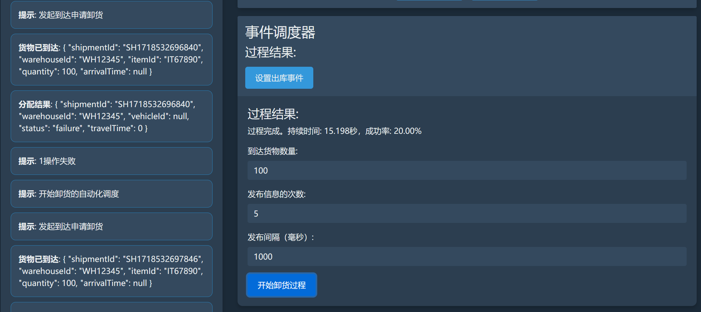

# 事件驱动的仓库存储系统
## 启动环境
- jdk 17
- 安装docker,在根目录命令行下运行 docker-compose up【我已经将docker封装了，运行这个代码可以启用环境，前提是你有docker】【要把kafka配置到本地localhost】
- 运行在根目录下的两个服务器
- 打开在currency-client/resource/static/show.html的网站，这是我们的自动化模拟网页
## 实现功能
- kafka信息交流
- 事件驱动系统实现自动存储
- websocket信号推送结果至网站
- 实现自动化模拟，实现事件链
- 可以调节测试参数比如仓库容量大小，车速和个数，并且获取测试结果，比如入库频率和入库成功率，入库时间
## 定义问题
开发一个系统来模拟从物流方接收货物，然后将货物放到仓库存储的过程。
我理解为一个发送器拿在员工手里，系统接收到员工的事件然后完成事件并发布成功信号
假设只有一个物流处为初始点，不处理如果有多个仓库仓库转运的问题，假设一批货物就是同一种货物，一个格子可以放100个货物
### 设计系统

这个项目是一个基于Spring Boot和Spring Cloud的事件驱动系统，使用Kafka进行消息传递和WebSocket进行实时通信。以下是项目中使用的关键技术和工具：

#### 项目结构

项目分为两个主要模块：

1. **currency-api**: 提供API接口服务。
2. **currency-client**: 作为客户端与`currency-api`进行交互。

### 主要技术栈

#### 1. Spring Boot

- **Spring Boot Starter**: 提供了一组开箱即用的组件，用于快速启动Spring应用程序。
   - `spring-boot-starter-actuator`: 提供监控和管理功能。
   - `spring-boot-starter-thymeleaf`: 用于整合Thymeleaf模板引擎。
   - `spring-boot-starter-web`: 用于构建Web应用，包括RESTful服务。
   - `spring-boot-starter-websocket`: 支持WebSocket协议，实现实时通信。
   - `spring-boot-starter-test`: 包含常用的测试库和框架。

#### 2. Spring Cloud

- **Spring Cloud Stream**: 用于构建消息驱动的微服务。
   - `spring-cloud-stream`: 基础依赖，用于消息传递。
   - `spring-cloud-stream-binder-kafka`: Kafka绑定器，用于与Kafka集成。
- **Spring Cloud Dependencies**: 管理Spring Cloud的依赖版本，确保兼容性。

#### 3. Kafka

- **Spring Kafka**: 提供对Apache Kafka的支持，简化Kafka客户端的配置和使用。
   - `spring-kafka`: Kafka客户端库，用于消息的生产和消费。
   - `spring-kafka-test`: Kafka测试库，用于测试Kafka相关功能。

#### 4. WebSocket

- **SockJS和Stomp**: 用于实现WebSocket协议的消息传递和管理。
   - `sockjs-client`: 提供SockJS客户端库，用于实现WebSocket的回退支持。
   - `stomp-websocket`: 提供STOMP协议支持，用于在WebSocket之上进行消息传递。

#### 5. 前端技术

- **WebJars**: 提供前端库的Java依赖管理方式。
   - `webjars-locator`: 自动定位WebJars中的资源。
   - `bootstrap`: 前端框架，用于响应式UI设计。
   - `jquery`: 常用的JavaScript库，用于DOM操作和Ajax请求。

#### 6. OpenAPI

- **SpringDoc OpenAPI**: 用于自动生成API文档。
   - `springdoc-openapi-starter-webmvc-ui`: 提供WebMVC的OpenAPI UI支持，生成Swagger文档。

#### 7. 其他工具和插件

- **Jsoup**: 用于解析和操作HTML。
   - `jsoup`: Java的HTML解析库。
- **Lombok**: 用于简化Java代码，通过注解自动生成常用方法。
   - `lombok`: 提供注解支持，如`@Data`，`@Builder`等。
- **Maven**: 用于构建和依赖管理。
   - `spring-boot-maven-plugin`: 用于打包和运行Spring Boot应用。
- 使用docker封装kafka增强可用性
````markdown
currency-api[这个是系统，接收客户发送的信号并返回结果事件]
├── src
│   ├── main
│   │   ├── java
│   │   │   └── com.snw.api
│   │   │       ├── config
│   │   │       │   └── [配置类，例如Kafka配置，Spring配置等]
│   │   │       ├── controller
│   │   │       │   └── [控制器类，处理HTTP请求，映射到REST API端点]
│   │   │       ├── domain
│   │   │       │   └── [领域类，业务实体和模型]
│   │   │       ├── event
│   │   │       │   └── [事件处理类，用于自定义事件]
│   │   │       ├── json
│   │   │       │   └── [JSON处理类，JSON数据]
│   │   │       ├── kafka
│   │   │       │   └── [Kafka相关类，处理Kafka消息的生产和消费]
│   │   │       ├── service
│   │   │       │   └── [服务类，包含业务逻辑和服务方法]
│   │   │       └── ApiApplication
│   │   │           └── [主应用程序类，Spring Boot的入口点，启动应用程序]
│   │   ├── resources
│   │   │   └── [资源文件夹，包含配置文件（如application.yml），静态资源等]
│   └── test
│       └── [测试文件夹，包含单元测试和集成测试类]

currency-client[这个是客户，发送事件，接收系统发送的信号并实现自动化调度和websocket信号管理]
├── src
│   ├── main
│   │   ├── java
│   │   │   └── com.snw.client
│   │   │       ├── config
│   │   │       │   └── [配置类，例如应用程序的客户端配置，远程服务配置等]
│   │   │       ├── controller
│   │   │       │   └── [控制器类，处理HTTP请求，通常映射到REST API端点]
│   │   │       ├── domain
│   │   │       │   └── [领域类，定义业务实体和模型]
│   │   │       ├── event
│   │   │       │   └── [事件处理类，用于处理客户端接收到的事件]
│   │   │       ├── kafka
│   │   │       │   └── [Kafka相关类，处理Kafka消息的生产和消费]
│   │   │       ├── schedule
│   │   │       │   └── [定时任务类，处理定时任务的逻辑]
│   │   │       └── ApiApplication
│   │   │           └── [主应用程序类，Spring Boot的入口点，启动应用程序]
│   └── resources
│       └── [放置的是自动化管理的静态网页]
````
## 仓库状态设置
### 数据结构描述
#### 1. 仓库（Warehouses）

| 属性             | 类型  | 描述                                               |
|------------------|-------|----------------------------------------------------|
| `id`             | String| 仓库的唯一标识符                                   |
| `availableSlots` | JSON  | 可用的格子信息，以JSON格式存储                     |
| `dimensions`     | JSON  | 仓库的三维尺寸，格式为{"x": 5, "y": 5, "z": 2}    |
| `distance`       | Number| 距离物流点的距离，单位为米                          |

- **示例**:
  ```json
  {
    "id": "WH1",
    "availableSlots": {"A1": 50, "A2": 30},
    "dimensions": {"x": 5, "y": 5, "z": 2},
    "distance": 100
  }
  ```

#### 2. 车辆（Vehicles）

| 属性             | 类型   | 描述                                               |
|------------------|--------|----------------------------------------------------|
| `id`             | String | 车辆的唯一标识符                                   |
| `type`           | String | 车辆类型，例如叉车(Forklift)或传送带(Conveyor)    |
| `speed`          | Number | 车辆速度，单位为米/秒                              |
| `status`         | String | 车辆状态，空闲(Idle)或使用中(In Use)               |
| `location`       | String | 车辆所在位置，仓库(Warehouse)，物流点(Logistic Point)或未知(Unknown) |

- **示例**:
  ```json
  {
    "id": "VEH1",
    "type": "Forklift",
    "speed": 5,
    "status": "Idle",
    "location": "Warehouse"
  }
  ```

#### 3. 升降机（Lifts）

| 属性         | 类型   | 描述                                               |
|--------------|--------|----------------------------------------------------|
| `id`         | String | 升降机的唯一标识符                                 |
| `speed`      | Number | 升降机速度，单位为米/秒                            |
| `status`     | String | 升降机状态，空闲(Idle)或使用中(In Use)             |
| `location`   | String | 升降机所在仓库的ID                                 |

- **示例**:
  ```json
  {
    "id": "LIFT1",
    "speed": 3,
    "status": "Idle",
    "location": "WH1"
  }
  ```

#### 4. 到达货物（Inbound）

| 属性          | 类型   | 描述                                                |
|---------------|--------|-----------------------------------------------------|
| `id`          | String | 到达货物的唯一标识符                                |
| `orderNumber` | String | 货物单号                                            |
| `details`     | String | 货物详情，直接给货物ID                              |
| `quantity`    | Number | 货物数量                                            |
| `documents`   | JSON   | 文件信息，以JSON格式存储（如发票、提单等）           |
| `status`      | String | 货物状态，已卸货(Unloaded)，未卸货(Not Unloaded)，已入库(In Stock) |
| `location`    | String | 货物位置，物流处(Logistic Point)或仓库ID            |
| `createdAt`   | String | 创建时间，ISO 8601格式                               |

- **示例**:
  ```json
  {
    "id": "INB1",
    "orderNumber": "ORD123456",
    "details": "ITEM123",
    "quantity": 50,
    "documents": {"invoice": "INV12345", "billOfLading": "BOL12345"},
    "status": "Not Unloaded",
    "location": "Logistic Point",
    "createdAt": "2024-06-16T10:00:00Z"
  }
  ```

#### 5. 库存（Inventory）

| 属性                | 类型   | 描述                                              |
|---------------------|--------|---------------------------------------------------|
| `id`                | String | 库存货物的唯一标识符                              |
| `orderNumber`       | String | 货物单号                                          |
| `details`           | String | 货物详情，直接给货物ID                            |
| `quantity`          | Number | 货物数量                                          |
| `documents`         | JSON   | 文件信息，以JSON格式存储（如发票、提单等）         |
| `status`            | String | 货物状态，入库(In Stock)或准备出库(Preparing for Outbound) |
| `location`          | String | 货物位置，仓库ID                                  |
| `warehousePosition` | JSON   | 货物在仓库中的位置，以{"x": x, "y": y, "z": z}表示 |
| `createdAt`         | String | 创建时间，ISO 8601格式                             |

- **示例**:
  ```json
  {
    "id": "INV1",
    "orderNumber": "ORD123456",
    "details": "ITEM123",
    "quantity": 100,
    "documents": {"invoice": "INV12345", "billOfLading": "BOL12345"},
    "status": "In Stock",
    "location": "WH1",
    "warehousePosition": {"x": 1, "y": 2, "z": 0},
    "createdAt": "2024-06-16T10:00:00Z"
  }
  ```

#### 6. 出库货物（Outbound）

| 属性          | 类型   | 描述                                               |
|---------------|--------|----------------------------------------------------|
| `id`          | String | 出库货物的唯一标识符                               |
| `orderNumber` | String | 货物单号                                           |
| `details`     | String | 货物详情，直接给货物ID                             |
| `quantity`    | Number | 货物数量                                           |
| `documents`   | JSON   | 文件信息，以JSON格式存储（如发票、提单等）          |
| `status`      | String | 货物状态，出库中(Outbound in Progress)或已出库(Outbound Completed) |
| `createdAt`   | String | 创建时间，ISO 8601格式                              |

- **示例**:
  ```json
  {
    "id": "OUT1",
    "orderNumber": "ORD123456",
    "details": "ITEM123",
    "quantity": 30,
    "documents": {"invoice": "INV12345", "billOfLading": "BOL12345"},
    "status": "Outbound in Progress",
    "createdAt": "2024-06-16T10:00:00Z"
  }
  ```

### 总结

- **Warehouses**: 管理仓库的信息，包括ID、可用格子、三维尺寸和距离。
- **Vehicles**: 管理车辆的信息，包括ID、类型、速度、状态和位置。
- **Lifts**: 管理升降机的信息，包括ID、速度、状态和位置。
- **Inbound**: 管理到达的货物信息，包括ID、货物单号、货物详情、数量、文件信息、状态、位置和创建时间。
- **Inventory**: 管理库存中的货物信息，包括ID、货物单号、货物详情、数量、文件信息、状态、位置、仓库中的位置和创建时间。
- **Outbound**: 管理出库的货物信息，包括ID、货物单号、货物详情、数量、文件信息、状态和创建时间。

### 事件驱动系统设计

描述、生产者和消费者的行为，以及合理的传输数据格式。

### 1. 主要事件（Events）

1. **GoodsArrived**：货物到达物流点。
   - **生产者**：物流系统或卸货请求发起者。
   - **消费者**：卸货服务。
   - **动作**：触发卸货流程，分配仓库ID。

2. **UnloadingStarted**：开始卸货。
   - **生产者**：卸货服务。
   - **消费者**：状态管理器、设备分配服务。
   - **动作**：记录开始卸货的时间，分配设备。

3. **UnloadingCompleted**：卸货完成。
   - **生产者**：卸货服务。
   - **消费者**：存储服务。
   - **动作**：记录卸货完成的时间，触发入库流程。

4. **InspectionCompleted**：检查和文档处理完成。
   - **生产者**：检查和文档处理服务。
   - **消费者**：仓库存储服务。
   - **动作**：触发将货物移入仓库内指定位置的过程。

5. **StorageLocationAllocated**：分配仓库存储位置。
   - **生产者**：仓库存储服务。
   - **消费者**：存储服务。
   - **动作**：触发将货物从仓库外运输到仓库的过程。

6. **StorageStarted**：入库开始。
   - **生产者**：仓库内的存储服务。
   - **消费者**：升降机控制服务。
   - **动作**：分配升降机，准备将货物从地面位置移动到最终存储位置。

7. **StorageCompleted**：入库结束。
   - **生产者**：升降机控制服务。
   - **消费者**：库存管理服务。
   - **动作**：更新库存，记录货物最终存储位置。

8. **OrderReceived**：接收到出库订单。
   - **生产者**：订单管理系统。
   - **消费者**：出库处理服务。
   - **动作**：触发货物出库流程。

9. **GoodsLoadingStarted**：出库开始。
   - **生产者**：出库处理服务。
   - **消费者**：状态管理器。
   - **动作**：更新货物状态，记录装载开始时间。

10. **GoodsShippedComplete**：出库结束。
    - **生产者**：出库处理服务。
    - **消费者**：状态管理器。
    - **动作**：更新货物状态，释放车辆。    

### 2. 事件的生产者和消费者行为

以下是每个事件的生产者和消费者如何互动的详细描述，和对应的api接口测试。

#### GoodsArrived

- **生产者**：物流系统发布此事件。
- **消费者**：卸货服务监听此事件，触发卸货流程，分配仓库ID。

```json
{
   "shipmentId": "SH12345",
   "warehouseId": "WH001",
   "itemId": "IT002",
   "quantity": 100,
   "arrivalTime": "2024-06-07T10:00:00Z"
}

```

**行为**：
- 生产者发布`GoodsArrived`事件，包含货物详细信息和仓库ID。
- 消费者（卸货服务）接收到此事件，触发卸货流程，给用户分配车辆，并返回车辆id和到达时间。
#### AssignmentResultEvent
- 返回系统的回复
````java
    public AssignmentResultEvent(String shipmentId, String warehouseId, String vehicleId, String status, int travelTime) {
        this.shipmentId = shipmentId;
        this.warehouseId = warehouseId;
        this.vehicleId = vehicleId;
        this.status = status;
        this.travelTime = travelTime;
    }
````

#### UnloadingStarted

- **生产者**：卸货服务发布此事件。
- **消费者**：状态管理器、设备分配服务监听此事件，分配适当的卸货设备。

```json
{
   "shipmentId": "SH12345",
   "warehouseId": "WH001",
   "vehicleId":"V001",
   "startTime": "2024-06-07T10:05:00Z"
}
```

**行为**：
- 生产者（卸货服务）在开始卸货时发布`UnloadingStarted`事件。
- 消费者（状态管理器、设备分配服务）接收到事件后，记录状态并分配卸货设备,并返回是否成功。
#### PostResultEvent
- 返回系统的回复
````java
    public PostResult(String status,String event){
        this.status = status;
        this.event = event;
    }
````
#### UnloadingCompleted

- **生产者**：卸货服务发布此事件。
- **消费者**：存储服务监听此事件，开始入库流程。

```json
{
  "shipmentId": "SH12345",
  "warehouseId": "WH001",
  "vehicleId":"V001",
  "completionTime": "2024-06-07T10:15:00Z"
}
```
**行为**：
- 生产者（卸货服务）在完成卸货时发布`UnloadingCompleted`事件。
- 消费者（存储服务）接收到事件后，触发入库流程,修改车的状态和入库表的状态。
  
------------------------------
入库流程
#### InspectionCompleted

- **生产者**：检查和文档处理服务发布此事件。
- **消费者**：仓库存储服务监听此事件，准备货物入库。
- 给数据库里的加上documents就好了
- 然后吧数据放到新表inventory里
```json
{
  "id": "IN001",
  "inspectionTime": "2024-06-07T10:25:00Z",
  "documents": {
    "invoice": "INV12345",
    "billOfLading": "BL12345",
    "warranty": "WT12345"
  }
}
```

**行为**：
- 生产者（检查和文档处理服务）在完成货物检查后发布`InspectionCompleted`事件。
- 消费者（仓库存储服务）接收到事件后，准备货物的入库。

#### StorageLocationAllocated

- **生产者**：仓库存储服务发布此事件。
- **消费者**：存储服务监听此事件，准备运输货物到仓库。
- 因为处理位置比较复杂，所以位置和数量是分开考虑的然后从上到下放比如（5，5，2）（5，0，2）（0，0，2）-（5，5，1）
- 处理完之后会自动给他分配格子，检查如果格子变成000，则容量也变成0
```json
{
  "status" :"succes"
           
}
```
**行为**：
- 生产者（仓库存储服务）在分配仓库位置时发布`StorageLocationAllocated`事件。
- 消费者（存储服务）接收到事件后，准备运输货物到仓库的具体位置。

#### StorageStarted

- **生产者**：仓库内的存储服务发布此事件。
- **消费者**：升降机控制服务监听此事件，分配升降机以开始入库过程。

```json
{
  "id": "IN001",
  "startTime": "2024-06-07T10:35:00Z"
}
```

**行为**：
- 生产者（仓库内的存储服务）在开始货物入库时发布`StorageStarted`事件。
- 消费者（升降机控制服务）接收到事件后，分配升降机以将货物移动到最终存储位置。

#### StorageCompleted

- **生产者**：升降机控制服务发布此事件。
- **消费者**：库存管理服务监听此事件，更新库存信息。

```json
{
  "shipmentId": "SH12345",
  "warehouseId": "WH001",
  "completionTime": "2024-06-07T10:45:00Z",
  "storageLocation": {"x": 2, "y": 3, "z": 1}
}
```

**行为**：
- 生产者（升降机控制服务）在完成货物入库时发布`StorageCompleted`事件。
- 消费者（库存管理服务）接收到事件后，更新库存信息并记录货物的最终存储位置。
-------------------------------------
#### OrderReceived

- **生产者**：订单管理系统发布此事件。
- **消费者**：出库处理服务监听此事件，触发货物出库流程,更新货物状态，增添出货名单，分配升降机。

```json
{
  "orderId": "ORD67890", 
   "itemId": "IT001",
   "quantity": 20
}
```

需要消费者收到信号后，检查有没有足够的库存，并检查有没有足够的lift车，有就返回好，把lift设置为在使用，并返回lift需要的时间和车号,并再outbound.json表里生成对应的出库信息，然后把库存表里的物品数量减掉
**行为**：
- 生产者（订单管理系统）在接收到出库订单时发布`OrderReceived`事件。
- 消费者（出库处理服务）出库处理服务监听此事件，触发货物出库流程,更新货物状态，增添出货名单，分配升降机。
#### OrderPostResult
- 返回系统的回复，等待时间，是否成功
````java
    public OrderPostResult(String status, int time,String liftId){
        this.status = status;
        this.time = time;
        this.liftId = liftId;
    }
````
#### GoodsShipped

- **生产者**：出库处理服务发布此事件。
- **消费者**：状态管理器、物流系统监听此事件，更新货物状态并通知物流系统。

```json
{
  "orderId": "ORD67890",
  "liftId": "L001"
}
```

**行为**：
- 生产者（出库处理服务）在货物准备运输到目的地时发布`GoodsShipped`事件。
- 消费者（状态管理器、物流系统）接收到事件后，更新货物状态并通知物流系统。

#### GoodsShippedComplete

- **生产者**：出库处理服务发布此事件。
- **消费者**：状态管理器、物流系统监听此事件，更新货物状态并通知物流系统。

```json
{
  "orderId": "ORD67890",
  "VehicleId": "L001"
}
```

**行为**：
- 生产者（出库处理服务）在货物准备运输到目的地时发布`GoodsShippedComplete`事件。
- 消费者（状态管理器、物流系统）接收到事件后，更新货物状态并通知物流系统。

### 3. 使用Kafka进行事件传输

Kafka是事件驱动系统的核心，用于高效传输和处理事件。以下是我们的使用逻辑：

- **主题（Topics）**：
   - 为每个事件类型创建一个单独的主题，例如`goods-arrived`、`unloading-started`等。
   - 使用分区（Partitions）来增加吞吐量和并行处理能力。

- **生产者（client）**：
   - 生产者根据事件类型将消息发送到相应的Kafka主题，我们可以理解成员工手里的信号发送器，他会发起一个项目，然后系统监听到，发布对应结果的项目。

- **消费者（api）**：
   - 监听client发布的事件，并处理，返回处理结果事件，并使用websocket推送到网址上。
### 4. 事件链和自动化模拟
- 我们将整个流程分成了卸货流程，入库流程，和出库流程，并且编写了自动化调度接口和网站可以调整仓库，卡车，升降机的信息，模拟在什么样频率的的请求下，
- 整个事件链的成功率是多少
- 这是我们自动化的代码的一部分，写成了一个完整的事件链，会根据系统返回的数据，比如预估到达事件，延后分配任务实现自动化调度
```java
 public void publishEvent(Object event) {
    String topic = determineTopic(event); // 根据事件类型确定要发布的主题

    if (event instanceof GoodsArrivedEvent) {
        // 处理商品到达事件
        messagingTemplate.convertAndSend("/topic/text", "开始卸货的自动化调度");
        messagingTemplate.convertAndSend("/topic/text", "发起到达申请卸货");
        messagingTemplate.convertAndSend("/topic/goodsArrived", event);
        log.info("GoodsArrived event sent: {}", event);

        // 等待分配结果并处理
        CompletableFuture<NextEventInfo> nextEventFuture = waitForNextEventInfo("assignment-result-out-0", event, topic);

        // 设置超时处理
        CompletableFuture<NextEventInfo> timeoutFuture = failAfterTimeout(100, TimeUnit.SECONDS);

        CompletableFuture.anyOf(nextEventFuture, timeoutFuture).thenAccept(result -> {
            if (result == timeoutFuture) {
                // 处理超时情况
                messagingTemplate.convertAndSend("/topic/text", "等待超时，操作失败");
                log.info("Operation failed due to timeout.");
            } else {
                NextEventInfo nextEventInfo = (NextEventInfo) result;
                if (nextEventInfo.isSuccess()) {
                    long delayMillis = nextEventInfo.getTime() * 6 * 100; // 计算延迟时间（单位为毫秒）
                    TypedelayMillis = delayMillis;
                    messagingTemplate.convertAndSend("/topic/text", "需要等待" + delayMillis + "毫秒车才来");
                    log.info("Scheduling UnloadingStartedEvent with delay: {} milliseconds", delayMillis);

                    // 调度卸货开始事件
                    scheduleNextEvent(
                            new UnloadingStartedEvent(
                                    ((GoodsArrivedEvent) event).getShipmentId(),
                                    ((GoodsArrivedEvent) event).getWarehouseId(),
                                    nextEventInfo.getTimestamp(),
                                    nextEventInfo.getVehicleId()
                            ),
                            delayMillis
                    );
                } else {
                    messagingTemplate.convertAndSend("/topic/text", "1操作失败");
                }
            }
        });

    }
    
}
```
- 这是我们实现的自动化模拟平台，可以调整参数（仓库大小，尺寸，升降机和车辆的个数，速度），模拟结果，并实现了实时的websocket信息推送（左侧）

- 这是我们实现的自动化模拟平台，可以调整参数，展示模拟结果

- 我们可以增加车辆，提高车辆速度再次模拟


- 这是卸货的信号展示
- 

- 这是出库的信号展示
- 