# 自动仓库管理系统报告

## 介绍
**背景和目的**

本项目旨在开发一个完善的订单管理系统，以支持在线零售业务的顺畅运作。随着电子商务的兴起，许多企业需要一个高效、可靠的系统来管理订单、库存和异常情况。该系统旨在提供全面的订单管理功能，包括创建订单、更新订单状态、取消订单以及异常处理等功能，同时结合库存管理，确保订单流程的顺利进行。

**开发目标和范围**

在开发过程中，我们的目标是建立一个功能完备、稳定可靠的订单管理系统，满足客户对订单处理和库存管理的需求。主要功能包括订单管理、订单商品管理、异常处理、入库和出库任务管理以及库存管理。

## 开发过程

**项目规划**
- 首先进行了需求分析，明确了系统功能和业务流程。
- 基于需求分析，设计了数据库模型和系统架构，确定了系统的技术栈和开发框架。

**设计阶段**
- 在设计阶段，详细规划了系统的各个模块和功能。
- 使用Swagger UI和OpenAPI规范设计了API文档，确保接口的一致性和易用性。

**实施阶段**
- 在实施阶段，采用了敏捷开发方法，通过迭代的方式逐步完善系统功能。
- 使用Spring Boot框架开发后端服务。

**测试阶段**
- 在测试阶段，进行了全面的接口测试。

**主要挑战和解决方案**
- 数据一致性和完整性： 在订单管理系统中，保持数据的一致性和完整性是一个重要挑战。解决方案包括事务管理、数据校验和异常处理机制。
- 性能优化： 随着订单数量的增加，系统性能可能会受到影响。采用Redis作为缓存数据库，以提高系统性能和响应速度。
- 复杂业务逻辑： 订单管理涉及到复杂的业务逻辑，如订单状态转换、库存检查等。通过合理的设计和模块化开发，将复杂业务逻辑拆分为可管理的模块，降低开发难度和风险。

**使用github**
- 使用github作为代码共享平台


项目地址：
https://github.com/hyxzjbnb/automated-warehouse-management-system.git


### 使用技术

- **Spring Boot**：使用版本为2.3.2.RELEASE的Spring Boot框架，用于快速开发应用程序。
  
- **Spring Data R2DBC**：Spring Data的一部分，用于通过反应式流的方式访问关系型数据库。

- **Spring Security**：Spring提供的安全框架，用于身份验证和访问控制。

- **Spring WebFlux**：Spring框架的响应式编程模块，用于构建响应式Web应用程序。

- **JWT (JSON Web Token)**：使用jjwt库版本0.9.1，用于在应用程序中实现基于令牌的身份验证。

- **Springdoc OpenAPI WebFlux UI**：用于生成基于OpenAPI规范的API文档，并提供Web界面以浏览API文档。

- **Spring Data Redis Reactive**：Spring Data的一部分，提供了与Redis数据库的响应式交互。

- **Lombok**：简化Java代码的工具库，通过注解自动生成Java类的样板代码。

- **R2DBC MySQL Connector**：用于与MySQL数据库进行响应式交互的库。

- **JUnit 5**：Java单元测试框架。

- **Reactor Test**：用于测试响应式代码的测试库。

- **Spring Security Test**：Spring提供的用于测试安全功能的支持库。

- **AspectJ**：Java的面向切面编程框架，用于处理横切关注点。

### 工具和插件

- **Maven**：Java项目的构建和依赖管理工具。

- **JUnit Platform**：JUnit的测试平台，用于执行基于JUnit的测试用例。

### 领域类技术详解

#### LoginDomain

- `LoginDomain` 类用于表示登录请求的领域对象。
- 它包含了用户名和密码两个属性，分别用于表示用户的身份信息。
- 使用了 `@NotBlank` 注解来确保用户名和密码不为空。
- 通过 `@Schema` 注解提供了一些关于字段的描述信息，比如默认值和必填属性。

#### RegisterDomain

- `RegisterDomain` 类用于表示注册请求的领域对象。
- 它包含了用户名、密码、确认密码、邮箱和电话等属性，用于表示用户注册时填写的信息。
- 使用了 `@NotBlank` 注解来确保用户名、密码和确认密码不为空，使用 `@Email` 注解来确保邮箱格式正确。
- 通过 `@Schema` 注解提供了一些关于字段的描述信息，比如默认值。

#### DevMessage

- `DevMessage` 类用于表示开发者消息，主要用于在调试和开发过程中输出调试信息。
- 它包含了消息内容和数据两个属性。
- 提供了两个构造方法，一个是传入数据对象，另一个是传入消息内容和数据对象。

#### HttpResult

- `Result` 类用于表示操作结果，包含了成功标志、消息、数据和错误列表等属性。
- 提供了静态方法用于创建成功或失败的结果对象，并提供了添加错误和开发者消息的方法。
- 这个类的设计使得可以统一规范API接口的返回格式，并方便地处理错误信息。

#### TResult

- `TResult` 类是对 `Result` 类的泛型扩展，可以指定返回数据的类型。
- 与 `Result` 类类似，包含了成功标志、消息、数据和错误列表等属性，以及创建成功或失败结果对象和添加错误信息的方法。

通过自定义的domain和Result使得项目具有良好的可读性、可维护性和扩展性，能够更好地满足业务需求。

### 三层架构技术详解

基于Spring Boot的三层架构应用，包括控制器层（Controller）、服务层（Service）、数据访问层（Repository）：

1. **控制器层（Controller）**：
   控制器层负责接收来自客户端的HTTP请求，并将请求委派给服务层进行处理。在这个例子中，`Controller`是控制器类。它使用了Spring的`@RestController`注解，表明这是一个RESTful风格的控制器，并使用`@RequestMapping`注解指定了控制器的基本路径为。控制器中的各个方法分别对应不同的HTTP请求方法（POST、PATCH、DELETE、GET），并通过`@Operation`注解提供了对每个操作的描述。

2. **服务层（Service）**：
   服务层包含了应用的业务逻辑，负责处理来自控制器的请求，并与数据访问层进行交互。在这个例子中，`Service`是服务类。它包含了一系列的业务方法，如创建订单、更新订单状态、取消订单等。每个方法都使用了`@Transactional`注解来确保方法内部的操作在一个事务中执行，以保证数据的一致性和完整性。在服务层中，还可以进行一些业务逻辑的处理，比如对订单状态的判断、库存的更新等。

3. **数据访问层（Repository）**：
   数据访问层负责与数据库进行交互，执行数据的持久化操作。在这个例子中，`Repository`是数据访问接口。

### 实现功能总结

### 基本需求
1. **定义和文档化一套Restful API**：(down)
   - 在进行程序编写前使用工具分析并制作了合理的api文档，并使用`@RestController`注解，表明这是一个RESTful风格的控制器。
   - api文档，需求分析文档请看附件。

2. **在Java中使用Spring Webflux和Boot实现API**：(down)
   - 在项目中利用Spring Boot框架快速搭建和配置项目基础。
   - 在项目中使用Spring Webflux来处理HTTP请求和响应。
   下面是代码的实现例子

### ApiProjectApplication.java

```java
package com.hyx.webflux.javaee;

import org.springframework.boot.SpringApplication;
import org.springframework.boot.autoconfigure.SpringBootApplication;


@SpringBootApplication
public class ProjectApplication {

    public static void main(String[] args) {
        SpringApplication.run(ProjectApplication.class, args);
    }

}

```
- 这个类是Spring Boot应用的入口类，使用了`@SpringBootApplication`注解来标识这是一个Spring Boot应用。

3. **实现数据仓储层至少使用关系型数据库管理系统(RDBMS)**：(down)
   - 以下是数据库设计
   - 数据库设计
       - 入库货物表 (InboundItems)
   
     | Column Name    | Data Type | Constraints                      |
     |----------------|-----------|----------------------------------|
     | inboundItemId  | Integer   | Not null, Auto-increment        |
     | inboundTaskId  | Integer   | Foreign Key (InboundTasks)     |
     | productId      | Integer   | Foreign Key (Products)         |
     | quantity       | Integer   | Not null                        |
     | productionDate | Date      | Not null                        |

       - 入库任务表 (InboundTasks)

     | Column Name   | Data Type     | Constraints              |
     |---------------|---------------|--------------------------|
     | inboundTaskId | Integer       | Not null, Auto-increment|
     | status        | String (50)   | Not null                 |
     | createdAt     | DateTime      | Not null                 |
     | updatedAt     | DateTime      | Not null                 |

       - 库存表 (Inventory)

     | Column Name   | Data Type   | Constraints                |
     |---------------|-------------|----------------------------|
     | inventoryId   | Integer     | Not null, Auto-increment  |
     | productId     | Integer     | Foreign Key (Products)    |
     | quantity      | Integer     | Not null                   |
     | lastUpdated   | DateTime    | Not null                   |

       - 订单表 (Orders)

     | Column Name   | Data Type    | Constraints                 |
     |---------------|--------------|-----------------------------|
     | orderId       | Integer      | Not null, Auto-increment   |
     | customerId    | Integer      | Foreign Key (Users)        |
     | status        | String (50)  | Not null                    |
     | createdAt     | DateTime     | Not null                    |
     | updatedAt     | DateTime     | Not null                    |

       - 订单异常表 (OrderExceptions)

     | Column Name   | Data Type    | Constraints                |
     |---------------|--------------|----------------------------|
     | exceptionId   | Integer      | Not null, Auto-increment  |
     | orderId       | Integer      | Foreign Key (Orders)       |
     | description   | String (500) | Not null                   |
     | createdAt     | DateTime     | Not null                   |

       - 订单商品表 (OrderItems)

     | Column Name   | Data Type  | Constraints               |
     |---------------|------------|---------------------------|
     | orderItemId   | Integer    | Not null, Auto-increment |
     | orderId       | Integer    | Foreign Key (Orders)      |
     | productId     | Integer    | Foreign Key (Products)    |
     | quantity      | Integer    | Not null                  |

       - 出库货物表 (OutboundItems)

     | Column Name     | Data Type | Constraints                       |
     |-----------------|-----------|-----------------------------------|
     | outboundItemId  | Integer   | Not null, Auto-increment         |
     | outboundTaskId  | Integer   | Foreign Key (OutboundTasks)      |
     | itemId          | Integer   | Foreign Key (InboundItems)       |
     | quantity        | Integer   | Not null                         |

       - 出库任务表 (OutboundTasks)

     | Column Name     | Data Type   | Constraints                     |
     |-----------------|-------------|---------------------------------|
     | outboundTaskId  | Integer     | Not null, Auto-increment       |
     | orderId         | Integer     | Foreign Key (Orders)            |
     | status          | String (50) | Not null                        |
     | createdAt       | DateTime    | Not null                        |
     | updatedAt       | DateTime    | Not null                        |

       - 产品表 (Products)

     | Column Name    | Data Type    | Constraints                   |
     |----------------|--------------|-------------------------------|
     | productId      | Integer      | Not null, Auto-increment     |
     | name           | String (100) | Not null                      |
     | description    | String (255) |                               |
     | price          | Decimal      | Not null                      |
     | productionDate | Date         |                               |

       - 用户表 (Users)

     | Column Name | Data Type | Constraints                  |
     |-------------|-----------|------------------------------|
     | id          | Integer   | Not null, Auto-increment    |
     | name        | String    | Unique, Not null             |
     | password    | String    |                              |
     | email       | String    | Valid Email Address          |
     | phone       | String    |                              |
     | address     | String    |                              |

       - 员工表 (Workers)

     | Column Name | Data Type | Constraints                 |
     |-------------|-----------|-----------------------------|
     | id          | Long      | Not null, Auto-increment   |
     | name        | String    |                             |
     | password    | String    |                             |
     | role        | String    |                             |

   - 选择了mysql作为数据存储层
   - 使用配置项在项目初始化的时候自动加载连接并初始化数据库
```yaml
spring:
  r2dbc:
    username: root
    password: "xxxx"
    url: r2dbcs:mysql://localhost:3306/warehouse_test_2?serverZoneId=Asia/Shanghai
  redis:
    host: "localhost"
    port: 6379
    client-name: ${spring.application.name}
    client-type: lettuce #provide reactive connection
    date_format: "dd-MM-yyyy"
    time_format: "HH:mm:ss"

jwt:
  expiration:
    duration: 3600
```
   - 在model层实现实体类，下面是实现实体类的例子
```java
package com.hyx.webflux.javaee.model;

/**
 * @author hyxzjbnb
 * @create 2024-05-28-16:06
 */
import org.springframework.data.annotation.Id;
import org.springframework.data.relational.core.mapping.Column;
import org.springframework.data.relational.core.mapping.Table;
import lombok.*;

import java.time.LocalDateTime;

@Data
@Builder
@NoArgsConstructor
@AllArgsConstructor
@Table("orders") // 注意R2DBC通常小写表名
public class Order {
    @Id
    Integer id;

    private Long uid;

    private String status;

    private LocalDateTime createdAt;

    private LocalDateTime updatedAt;

}

```
- **Lombok:**
  - Lombok通过注解自动生成Java代码，通过在实体类上添加注解，如`@Getter`、`@Setter`、`@NoArgsConstructor`、`@AllArgsConstructor`、`@ToString`、`@Builder`，自动生成相应的方法或构造函数。

4. **使用Boot测试框架和Web API进行测试**：(down)
   - 使用了Spring Boot提供的测试框架WebTestClient进行自动化测试，下面是一个测试代码的例子
```java
@SpringBootTest(webEnvironment = RANDOM_PORT)
@AutoConfigureWebTestClient
public class OrderControllerTest {

    @Autowired
    private WebTestClient webTestClient;
    @Test
    void testCreateOrder() {
        Order order = new Order();
        order.setUid(12L);
        order.setStatus("Pending");
        order.setCreatedAt(LocalDateTime.now());
        order.setUpdatedAt(LocalDateTime.now());
        System.out.println(order);
        webTestClient.post().uri("/orders")
                .contentType(MediaType.APPLICATION_JSON)
                .bodyValue(order)
                .exchange()
                .expectStatus().isOk()
                .expectBody()
                .jsonPath("$.code").isEqualTo("200");
    }

    @Test
    void testUpdateOrderStatus() {
        Integer orderId = 1;
        String newStatus = "Processing";

        webTestClient.patch().uri(uriBuilder ->
                        uriBuilder.path("/orders/{orderId}")
                                .queryParam("status", newStatus)
                                .build(orderId))
                .exchange()
                .expectStatus().isOk()
                .expectBody()
                .jsonPath("$.code").isEqualTo("200");
    }


    @Test
    void testCancelOrder() {
        Integer orderId = 2;

        webTestClient.delete().uri("/orders/{orderId}", orderId)
                .exchange()
                .expectStatus().isOk()
                .expectBody()
                .jsonPath("$.code").isEqualTo("200");
    }

    @Test
    void testGetOrders() {
        webTestClient.get().uri(uriBuilder -> uriBuilder.path("/orders")
                        .queryParam("uid", 1)
                        .queryParam("status", "Pending")
                        .build())
                .exchange()
                .expectStatus().isOk()
                .expectBody()
                .jsonPath("$.code").isEqualTo("200");
    }
}
```
**单元测试**：
- 针对每个API端点进行测试，例如`testCreateOrder`测试创建订单功能。
- 使用Mockito框架模拟服务层行为，验证控制器行为是否符合预期。
- 在每个测试方法中，模拟调用服务层方法，例如`when(orderService.createOrder(any(Order.class)))`模拟订单服务的`createOrder`方法。

**集成测试**：
- 使用Spring Boot提供的`@WebTestClient`注解进行集成测试，启动Spring MVC应用程序，模拟HTTP请求和响应。
- 使用`MockMvc`对象模拟HTTP请求，验证控制器的响应是否符合预期。
- 例如，测试方法中模拟POST请求发送到`/orders`端点，并验证响应状态码为200，订单状态为"Pending"。

- 使用了postman进行手动测试


5. **API认证**：(down)
   - 使用JWT实现了权限控制,使得使用接口的命令必须是已经注册登入的用户，并设置webfliter分别拦截用户支持的接口
   - 同时在sercurity类里实现了自定义的方法参数实现解析token并判断
```java

/**
 * @author hyxzjbnb
 * @create 2024-05-25-22:35
 */
@Component
@Slf4j
@AllArgsConstructor
public class JwtWebFilter implements WebFilter {

    private final JwtSigner jwtSigner;
    private static final Set<String> IGNORE_PATHS = new HashSet<>();

    static {
        IGNORE_PATHS.add("/auth/login");
        IGNORE_PATHS.add("/auth/signout");
        IGNORE_PATHS.add("/auth/signup");
    }

    protected Mono<Void> writeErrorMessage(ServerHttpResponse response, HttpStatus status, String msg) throws JsonProcessingException, UnsupportedEncodingException {
        response.getHeaders().setContentType(MediaType.APPLICATION_JSON);
        ObjectMapper mapper=new ObjectMapper();
        String body = mapper.writeValueAsString(new HttpResult(status.value(), msg, null));
        DataBuffer dataBuffer = response.bufferFactory().wrap(body.getBytes(StandardCharsets.UTF_8));
        return response.writeWith(Mono.just(dataBuffer));
    }

    @SneakyThrows
    @Override
    public Mono<Void> filter(ServerWebExchange exchange, WebFilterChain chain) {
        ServerHttpRequest request = exchange.getRequest();
        ServerHttpResponse response = exchange.getResponse();

        String path = request.getPath().value();
        Check if the path is one of the ignored paths
       if (IGNORE_PATHS.stream().anyMatch(path::contains)) {
           return chain.filter(exchange);
       }
       String auth = request.getHeaders().getFirst(HttpHeaders.AUTHORIZATION);
       if (auth == null) {
           return this.writeErrorMessage(response, HttpStatus.NOT_ACCEPTABLE, "没有携带token");
       }
       else if (!auth.startsWith(jwtSigner.getTokenPrefix())) {
           return this.writeErrorMessage(response, HttpStatus.NOT_ACCEPTABLE, "token 没有以" + jwtSigner.getTokenPrefix() + "开始");
       }

       String token = auth.replace(jwtSigner.getTokenPrefix(),"");
       try {
           exchange.getAttributes().put("token", token);
       } catch (Exception e) {
           return this.writeErrorMessage(response, HttpStatus.INTERNAL_SERVER_ERROR, e.getMessage());
       }

        return chain.filter(exchange);
    }
}

```
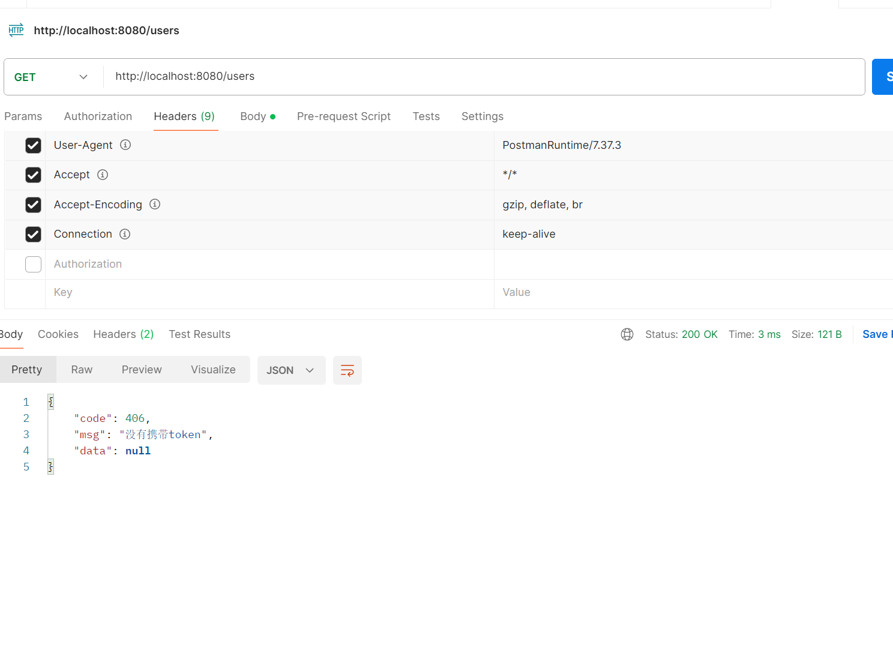
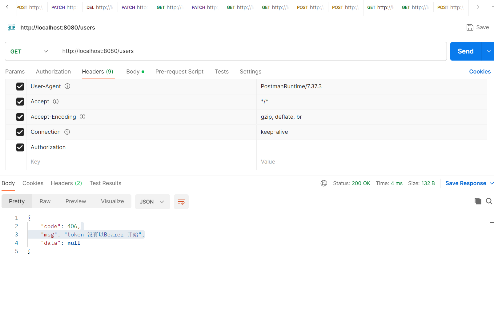
### 额外实现（加分项）
1. **缓存（Caching）**：(down)
   - 使用redis缓存，减少数据库访问次数，提高应用性能。具体应用是实现了先查缓存再查数据库,然后把热门商品放入缓存就可以大大减少数据库的使用
```yaml
# Redis连接配置
  redis:
    host: "localhost"
    port: 6379
    client-name: ${spring.application.name}
    client-type: lettuce #provide reactive connection
    date_format: "dd-MM-yyyy"
    time_format: "HH:mm:ss"

```
```java
public class RedisReactiveCacheConfig {
   //具体请参考源代码
    @Bean
    @Primary
    public ReactiveRedisTemplate<String, Object> reactiveRedisTemplate(ReactiveRedisConnectionFactory reactiveRedisConnectionFactory,
                                                                       ObjectMapper objectMapper) {

        Jackson2JsonRedisSerializer<Object> serializer = new Jackson2JsonRedisSerializer<>(Object.class);
        serializer.setObjectMapper(objectMapper);

        return new ReactiveRedisTemplate(reactiveRedisConnectionFactory,
                RedisSerializationContext.newSerializationContext(serializer)
                        .key(new GenericToStringSerializer(String.class))
                        .hashKey(new GenericToStringSerializer(String.class))
                        .value(serializer)
                        .hashValue(serializer)
                        .build()
        );
    }

    @Bean
    public AspectUtils aspectUtils() {
        return new AspectUtils();
    }
}
//同时在annotation里封装了可以自动添加数据进redis里的注解
//实现了
* `@RedisReactiveCacheAdd` - stores cache after the method execution behind the scenes without blocking server response.
* `@RedisReactiveCacheGet` - gets cache, if cache not available, it will execute the method and store the result (without blocking server response) in cache for future use.
* `@RedisReactiveCacheUpdate` - removes cache without blocking, execute annotated method and store the result in cache (without blocking server response).
* `@RedisReactiveCacheEvict` - removes cache without blocking.
    
```
```java
//如果缓存查不到就查数据库
   @RedisReactiveCacheGet(key = "#product.name")
    public Mono<Product> getProductById(Product product) {
        int id = product.getId();
        return productRepository.findById(id);
    }
```
* `@RedisReactiveCacheAdd` - 在方法执行后台存储缓存，而不会阻塞服务器响应。
* `@RedisReactiveCacheGet` - 获取缓存，如果缓存不存在，则执行方法并将结果（不阻塞服务器响应）存储在缓存中以供将来使用。
* `@RedisReactiveCacheUpdate` - 在不阻塞的情况下移除缓存，执行带有注解的方法，并将结果存储在缓存中（不阻塞服务器响应）。
* `@RedisReactiveCacheEvict` - 在不阻塞的情况下移除缓存。

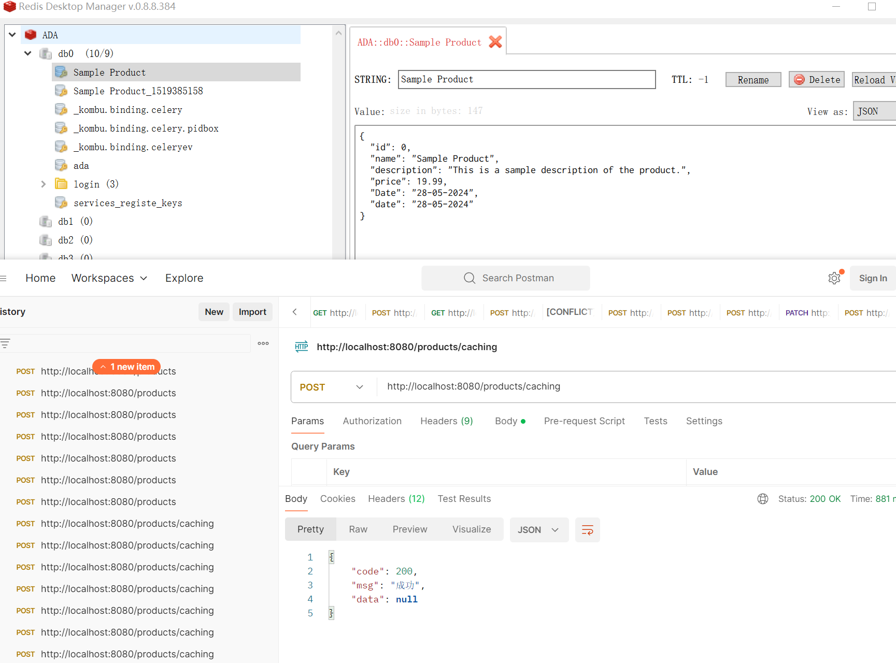
2. **会话控制（Session Control）**：(down)
 实现sessionController的代码，可以支持用接口查看，验证，删除会话的功能
```java
@Slf4j
@RestController
@RequestMapping("session")
public class SessionController {

    @GetMapping
    public Mono<WebSession> getSession(final WebSession webSession) {
        return Mono.just(webSession);
    }

    @GetMapping("create")
    public Mono<String> createSession(final WebSession webSession) {
        webSession.start();
        return Mono.just("create session => " + webSession.getId());
    }

    @GetMapping("invalidate")
    public Mono<String> invalidateSession(final WebSession webSession) {
        return webSession.invalidate()
                .then(Mono.just("invalidate session => " + webSession.getId()));
    }
}

```
   
3. **日志（Log）**：(down)
   - 使用@Slf4j实现日志管理
```yaml

logging:
  level:
    root: INFO
    org.springframework: INFO
    com.ffzs.webflux: DEBUG  # 设置你的应用程序包的日志级别
  file:
    name: file.log  # 将日志输出到文件
  pattern:
    console: "%d{yyyy-MM-dd HH:mm:ss} [%thread] %-5level %logger{36} - %msg%n"  # 控制台输出格式
    file: "%d{yyyy-MM-dd HH:mm:ss} [%thread] %-5level %logger{36} - %msg%n"     # 文件输出格
```

1. `@Slf4j` 注解：这是一个Lombok提供的注解，用于自动生成Slf4j的日志记录器（Logger）。

2. `logging` 部分：

   - `level`：指定了根日志级别为 `info`，这意味着只有 `info` 级别及以上的日志信息才会被记录。
   
   - `file`：指定了日志文件的名称为 `app.log`。
   
   - `pattern`：指定了控制台和日志文件输出的日志格式，包括日期、线程名、日志级别、Logger名称、消息等信息。


4. **限流（Rate Limiting）**：(down)
   - 使用令牌桶进行限流
```java
import lombok.extern.slf4j.Slf4j;

import java.util.concurrent.atomic.AtomicInteger;
@Slf4j
public class TokenBucket {

    private final int capacity; // 令牌桶容量
    private final AtomicInteger tokens; // 当前令牌数量

    public TokenBucket(int capacity) {
        this.capacity = capacity;
        this.tokens = new AtomicInteger(capacity);
    }

    public boolean allowRequest() {
        while (true) {
            int currentTokens = tokens.get();
            if (currentTokens == 0) {
                return false; // 令牌桶中没有可用的令牌
            }
            if (tokens.compareAndSet(currentTokens, currentTokens - 1)) {
                return true; // 消耗一个令牌
            }
        }
    }

    public void refill() {
        tokens.set(capacity); // 重新填满令牌桶
    }
}
```
```java
import java.lang.annotation.ElementType;
import java.lang.annotation.Retention;
import java.lang.annotation.RetentionPolicy;
import java.lang.annotation.Target;

@Retention(RetentionPolicy.RUNTIME)
@Target(ElementType.METHOD)
public @interface RateLimit {
    int value() default 100; // 默认的令牌桶容量
}
``` 
  - 在annotation中声明RateLimit注释
```java
@Component
public class RateLimitInterceptor implements HandlerInterceptor {

    TokenBucket tokenBucket;

    @Autowired
    public void setRateLimitInterceptor(TokenBucket tokenBucket) {
        this.tokenBucket = tokenBucket;
    }

    @Override
    public boolean preHandle(@NotNull HttpServletRequest request, @NotNull jakarta.servlet.http.HttpServletResponse response, @NotNull Object handler) throws Exception {
        // 在此处检查请求是否超出了速率限制
        if (!tokenBucket.allowRequest()) {
            // 如果超出了速率限制，可以根据实际情况进行处理，例如返回错误信息或者拒绝请求
            response.setStatus(429); // 请求过多，使用状态码 429
            response.getWriter().write("Too many requests"); // 返回自定义的错误信息
            return false;
        }
        return true;
    }
}
```  
  - 同时创建TokenBucketFilter implements WebFilter拦截器
```java
 @Component
@EnableScheduling
@Order(Ordered.HIGHEST_PRECEDENCE) // Ensure this filter is one of the first to run
public class TokenBucketFilter implements WebFilter {

    private final TokenBucket tokenBucket;

    public TokenBucketFilter(TokenBucket tokenBucket) {
        this.tokenBucket = tokenBucket;
    }

    protected Mono<Void> writeErrorMessage(ServerHttpResponse response, HttpStatus status, String msg) throws JsonProcessingException, UnsupportedEncodingException {
        response.getHeaders().setContentType(MediaType.APPLICATION_JSON);
        ObjectMapper mapper=new ObjectMapper();
        String body = mapper.writeValueAsString(new HttpResult(status.value(), msg, null));
        DataBuffer dataBuffer = response.bufferFactory().wrap(body.getBytes(StandardCharsets.UTF_8));
        return response.writeWith(Mono.just(dataBuffer));
    }
    @SneakyThrows
    @Override
    public Mono<Void> filter(ServerWebExchange exchange, WebFilterChain chain) {
        ServerHttpRequest request = exchange.getRequest();
        ServerHttpResponse response = exchange.getResponse();
        String path = request.getPath().value();
        if (path.startsWith("/products1111")) {
            if (tokenBucket.allowRequest()) {
                return chain.filter(exchange);
            } else {
                return this.writeErrorMessage(response, HttpStatus.NOT_ACCEPTABLE, "请求被限流");
            }
        }else{
            return chain.filter(exchange);
        }
    }

    @Scheduled(fixedRate = 60000) // 每分钟重新填充一次
    public void refillTokens() {
        tokenBucket.refill();
    }
}
-----------------------------------------------------
    @Bean
    public TokenBucket tokenBucket() {
        // 在此可以根据需要指定令牌桶的容量
        return new TokenBucket(100); // 假设令牌桶容量为 100
    }
------------------------------------------------------------
        registry.addInterceptor(rateLimitInterceptor)
                .addPathPatterns("/**");
```
  - 在配置类里注入bean，并在MyInterceptorConfiguration调用拦截器
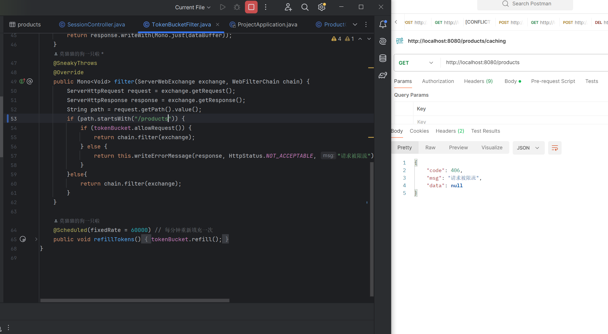

5. **分页实现**：(down)
  因为不能使用jpa，所以在controller里面自己完成了分页实现
```java
public static class SliceRequest implements Pageable {

        private final long offset;

        private final int limit;

        private final Sort sort;

        protected SliceRequest(final long offset, final int limit, final Sort sort) {
            this.offset = offset;
            this.limit = limit;
            this.sort = sort;
        }

        public static SliceRequest of(final long offset, final int limit, final Sort sort) {
            return new SliceRequest(offset, limit, sort);
        }

        public static SliceRequest of(final long offset, final int limit) {
            return of(offset, limit, Sort.unsorted());
        }

        @Override
        public int getPageNumber() {
            return -1;
        }

        @Override
        public int getPageSize() {
            return limit;
        }

        @Override
        public long getOffset() {
            return offset;
        }

        @Override
        public Sort getSort() {
            return sort;
        }

        @Override
        public Pageable next() {
            return null;
        }

        @Override
        public Pageable previousOrFirst() {
            return null;
        }

        @Override
        public Pageable first() {
            return null;
        }

        @Override
        public boolean hasPrevious() {
            return false;
        }
    }
```
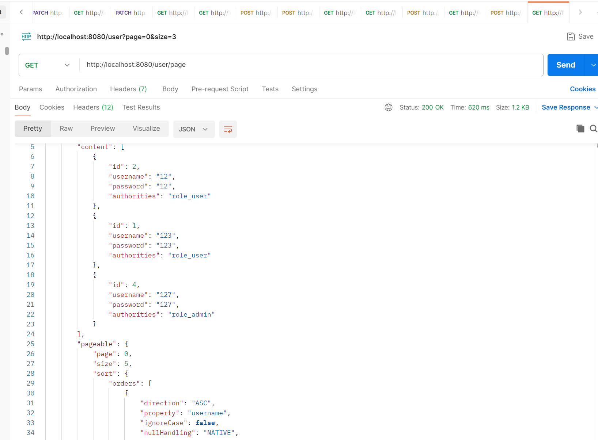

## 测试结果

这是我们实现webtestclient的结果,老师可以自行运行测试(不需要数据库)
数据库sql语句在根目录下,如运行可以直接调用
以下是我们手动测试的结果(postman)
### 1. 订单管理 API (down)
#### 创建订单
- **POST /orders**
    - **描述**：创建一个新订单，同时进行库存检查和用户验证。
    - **请求体**：包含用户ID、商品列表（每个商品包括产品ID和数量）。
    - **响应**：订单详情，包括订单ID、订单状态等。
      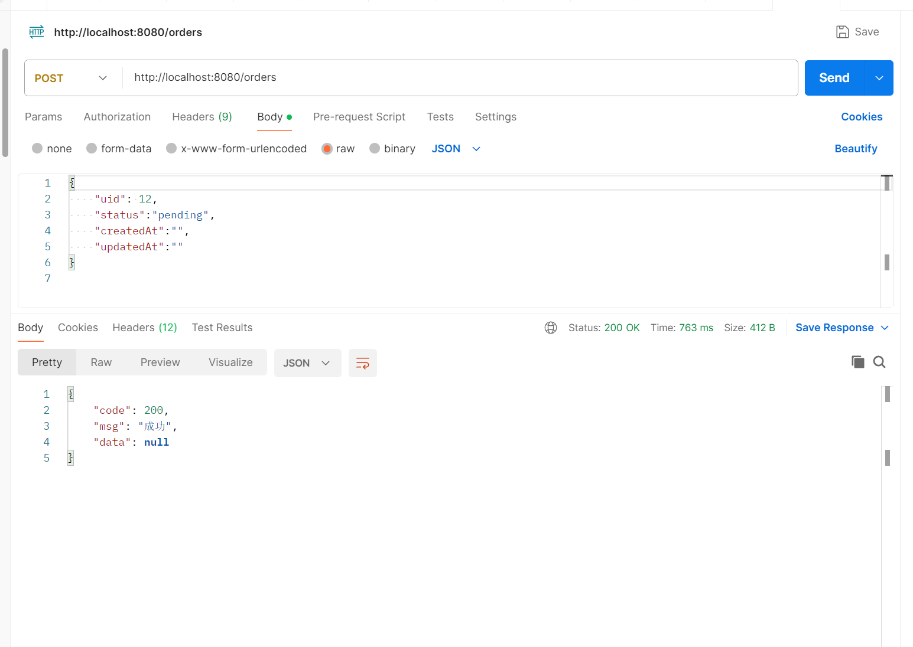
#### 更新订单状态
- **PATCH /orders/{orderId}**
    - **描述**：更新订单的状态。
    - **路径参数**：`orderId` - 订单的唯一标识。
    - **请求体**：包含新的订单状态。
    - **响应**：更新后的订单详情。
      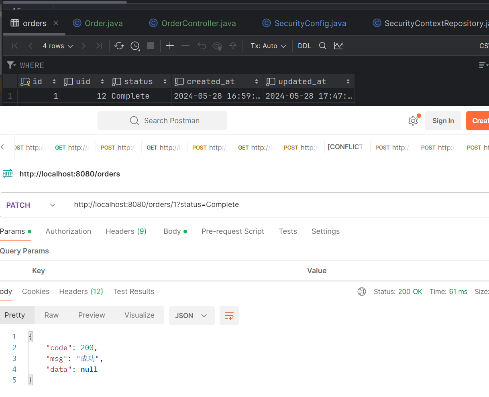
#### 取消订单
- **DELETE /orders/{orderId}**
    - **描述**：取消订单，并回滚库存。
    - **路径参数**：`orderId` - 订单的唯一标识。
    - **响应**：操作结果。
      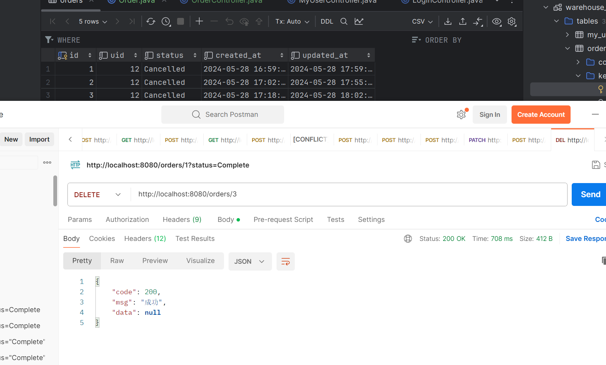
#### 查询订单
- **GET /orders**
    - **描述**：根据用户或状态查询订单。
    - **查询参数**：`userId`, `status`。
    - **响应**：符合条件的订单列表。
      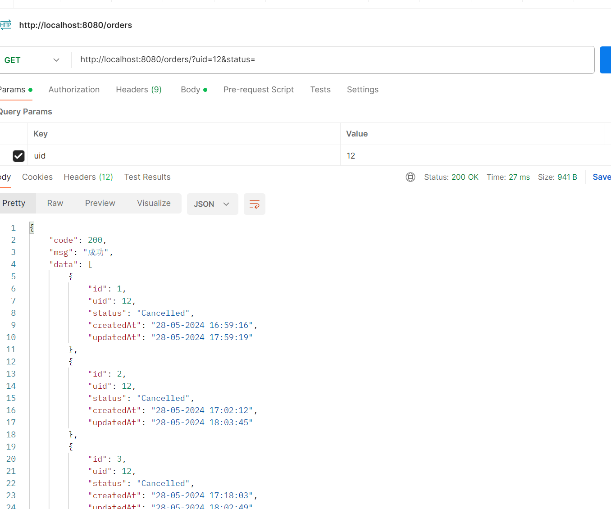
### 2. 订单商品管理 (down)

#### 添加商品到订单
- **POST /order-items**
    - **描述**：为特定订单添加商品。
    - **请求体**：订单ID、商品ID和数量。
    - **响应**：新创建的订单商品条目详情。
      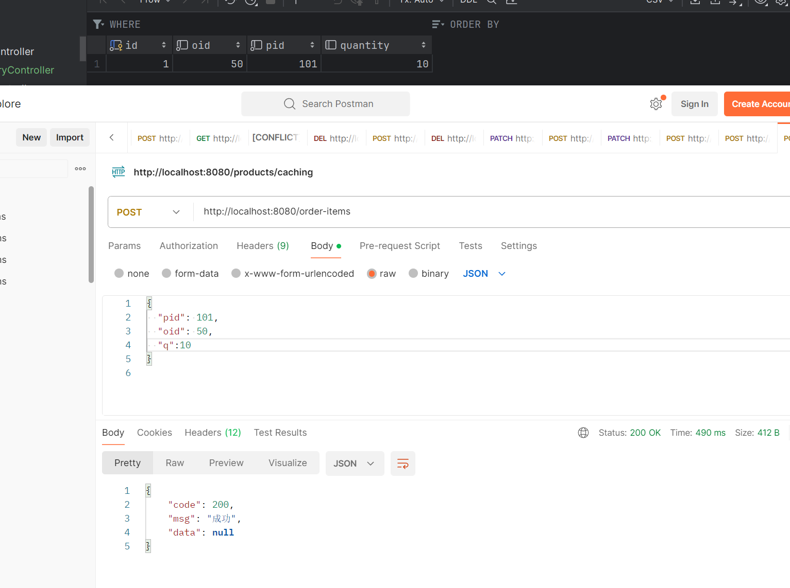
    - 
#### 更新订单商品
- **PATCH /order-items/{orderItemId}**
    - **描述**：更新订单中某个商品的数量。
    - **路径参数**：`orderItemId` - 订单商品条目的唯一标识。
    - **请求体**：新的数量。
    - **响应**：更新后的订单商品条目详情。
      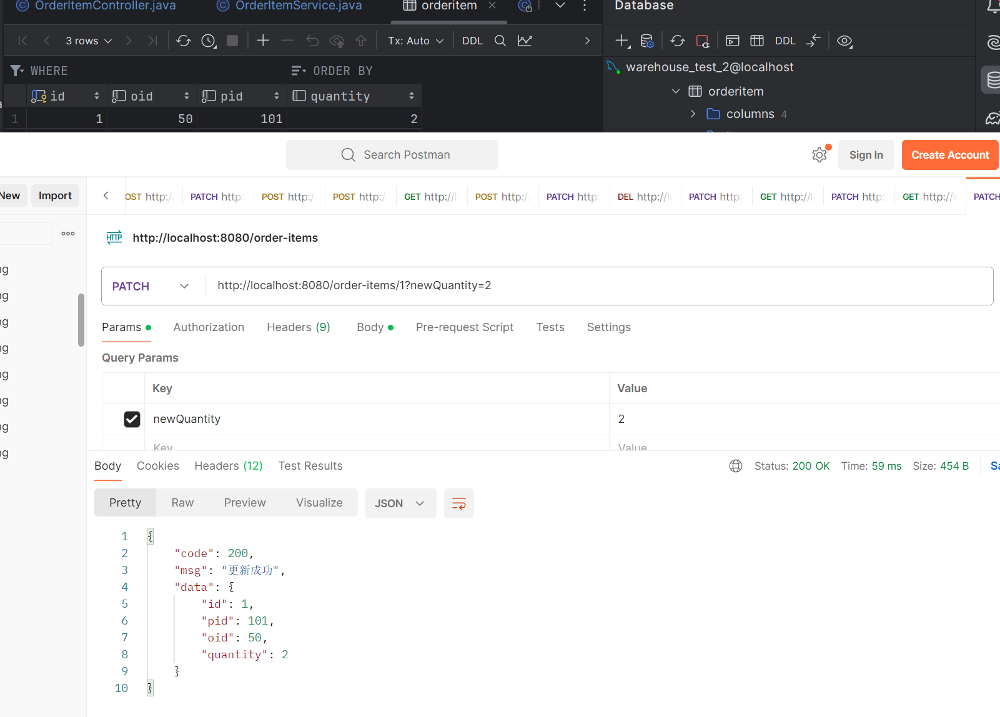
#### 删除订单商品
- **DELETE /order-items/{orderItemId}**
    - **描述**：从订单中删除一个商品，并更新库存。
    - **路径参数**：`orderItemId`。
    - **响应**：操作结果。
      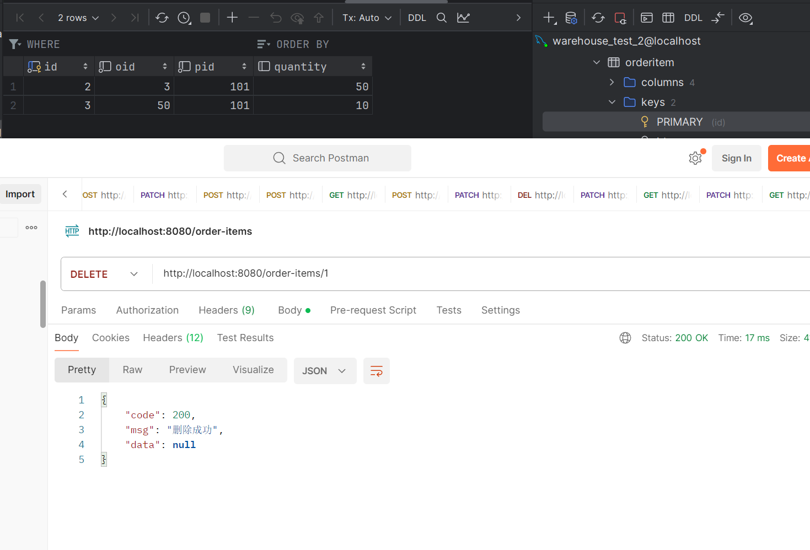

### 3. 入库任务管理 API(DOWN)

#### 创建入库任务
- **POST /inbound-tasks**
    - **描述**：创建一个新的入库任务。
    - **请求体**：相关细节，如员工ID、预定入库时间等。
    - **响应**：入库任务详情。
      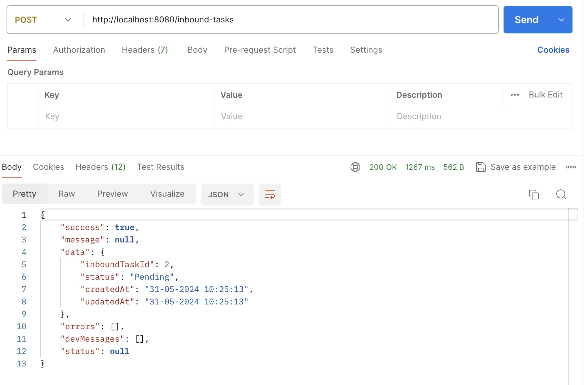
#### 更新入库任务状态
- **PATCH /inbound-tasks/{taskId}**
    - **描述**：更新入库任务的状态。
    - **路径参数**：`taskId`。
    - **请求体**：新的任务状态。
    - **响应**：更新后的任务详情。
      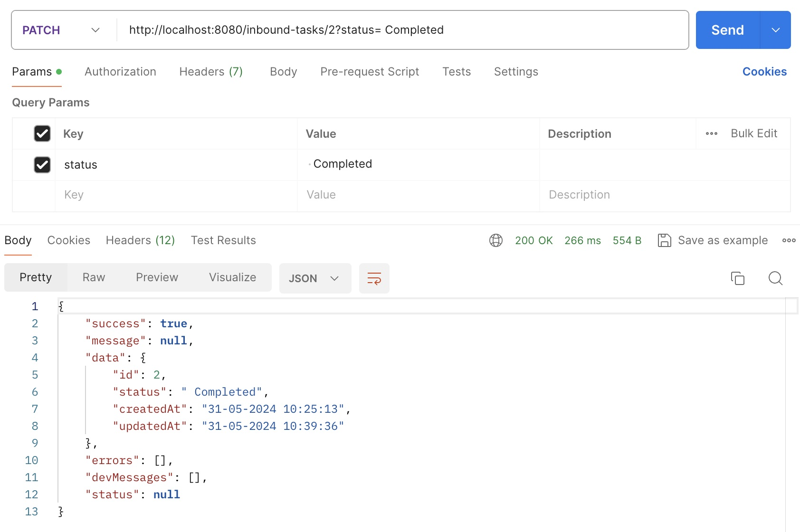
#### 删除入库任务
- **GET /inbound-tasks**
    - **描述**：按id删除入库任务。
    - **路径参数**：`taskId`。
    - **响应**：删除成功。
      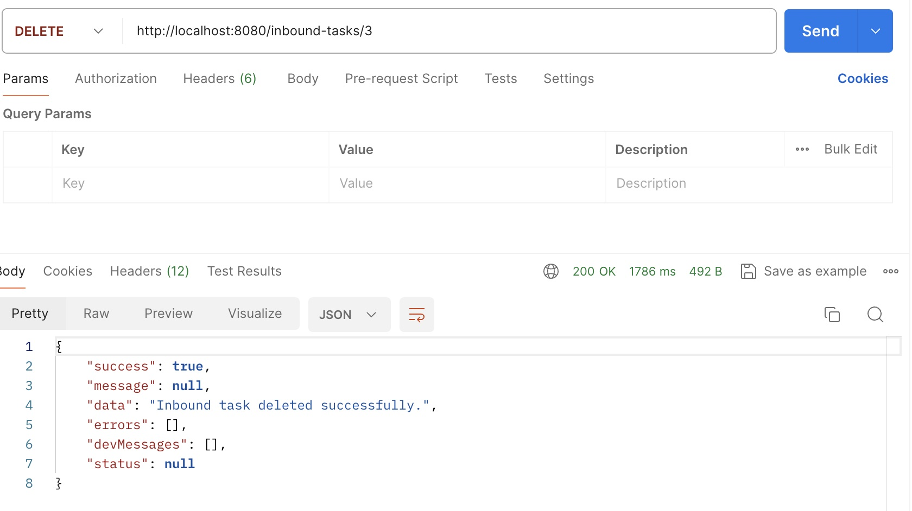
### 5. 出库任务管理 API(down)

#### 创建出库任务
- **POST /outbound-tasks**
    - **描述**：为订单创建出库任务。
    - **请求体**：订单ID、预定出库时间等。
    - **响应**：出库任务详情。
      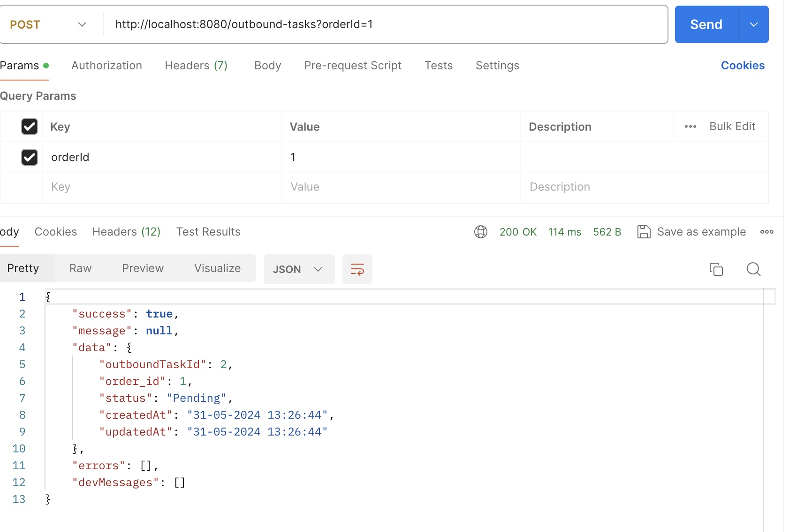
#### 更新出库任务
#### 更新出库任务状态
- **PATCH /outbound-tasks/{taskId}**
    - **描述**：更新出库任务的状态。
    - **路径参数**：`taskId` - 出库任务的唯一标识。
    - **请求体**：包含新的任务状态。
    - **响应**：更新后的出库任务详情。
      
#### 查询出库任务
- **GET /outbound-tasks**
    - **描述**：按状态或日期范围查询出库任务。
    - **查询参数**：`status`, `startDate`, `endDate`。
    - **响应**：符合条件的出库任务列表。
      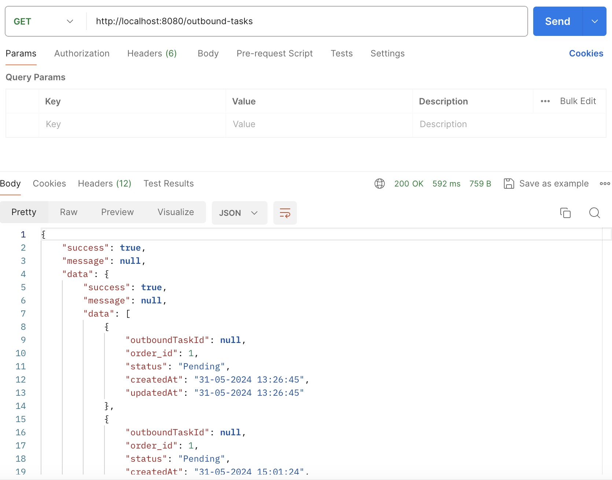
### 6. 库存管理 API

#### 更新库存
- **PATCH /inventory/{productId}**
    - **描述**：更新指定产品的库存数量。
    - **路径参数**：`productId` - 产品的唯一标识。
    - **请求体**：包含库存的增加或减少数量。
    - **响应**：更新后的库存详情。
      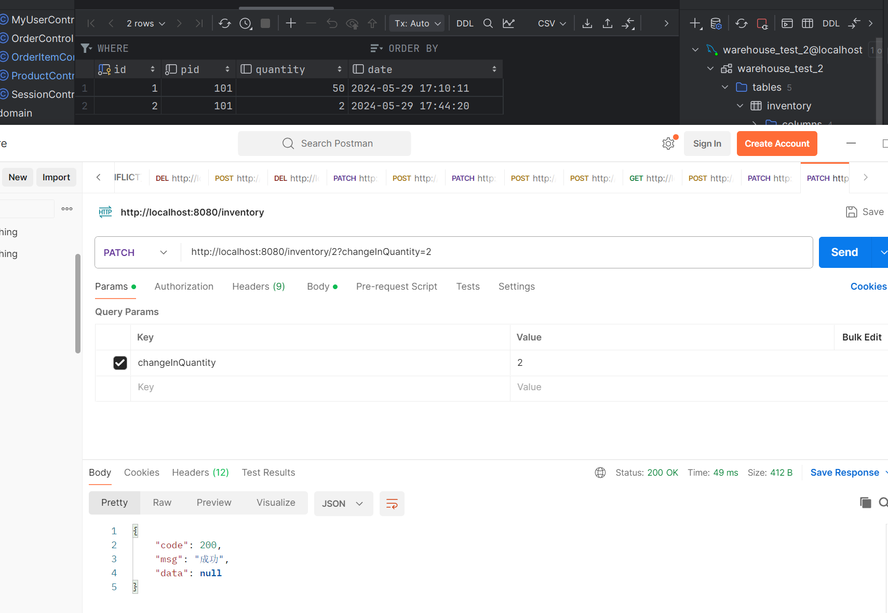
#### 查询库存
- **GET /inventory**
    - **描述**：查询特定产品的当前库存量。
    - **查询参数**：`productId`。
    - **响应**：指定产品的库存详情。
      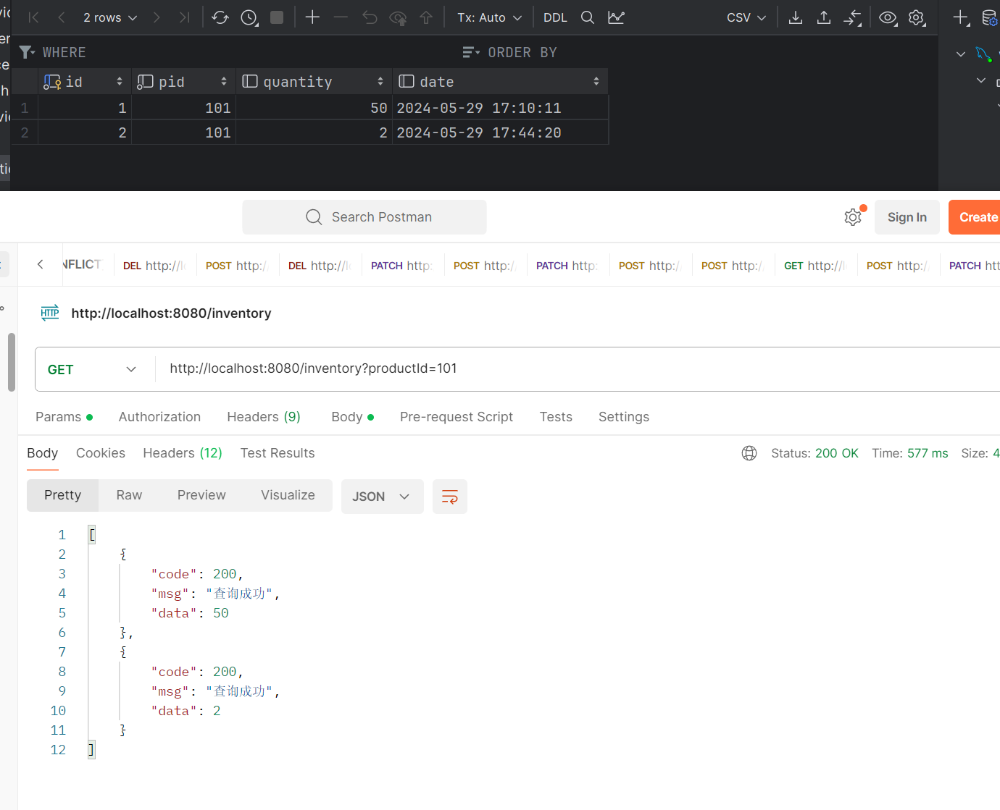
#### 创建库存
- **GET /inventory/warnings**
    - **描述**：创建库存内容
    - **响应**：
      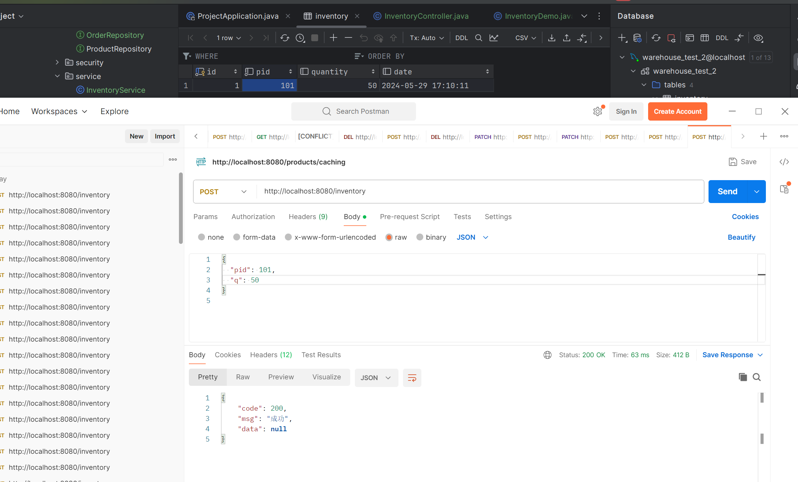
### 7. 产品管理 API(down)

#### 添加产品信息
- **POST /products/caching**
    - **描述**：添加新的产品信息到缓存数据库。
    - **请求体**：包含产品的名称、描述、初始库存量等信息。
    - **响应**：新创建的产品详情。
      
- **POST /products**
    - **描述**：添加新的产品信息到缓存数据库。
    - **请求体**：包含产品的名称、描述、初始库存量等信息。
    - **响应**：新创建的产品详情。
      
#### 获取产品信息
- **GET /products/caching**
    - **描述**：根据产品ID获取产品信息,先从缓存获取，缓存获取不了从数据库获取
    - **路径参数**：`productId`。
    - **响应**：产品详情。
      
#### 更新产品信息
- **PATCH /products/caching**
    - **描述**：同时更新缓存和数据库的数据。
    - **路径参数**：`productId`。
    - **请求体**：产品的新信息，如名称、描述等。
    - **响应**：更新后的产品详情。
       
#### 删除产品信息
- **DELETE /products/**
    - **描述**：从数据库和缓存删除指定的产品信息。
    - **路径参数**：`productId`。
    - **响应**：操作结果。
      

#### 删除产品信息
- **DELETE /products/caching**
    - **描述**：从缓存删除指定的产品信息。
    - **路径参数**：`productId`。
    - **响应**：操作结果。
      
