# 自动仓库管理系统报告

## 介绍
**背景和目的**

本项目旨在开发一个完善的订单管理系统，以支持在线零售业务的顺畅运作。随着电子商务的兴起，许多企业需要一个高效、可靠的系统来管理订单、库存和异常情况。该系统旨在提供全面的订单管理功能，包括创建订单、更新订单状态、取消订单以及异常处理等功能，同时结合库存管理，确保订单流程的顺利进行。

**开发目标和范围**

在开发过程中，我们的目标是建立一个功能完备、稳定可靠的订单管理系统，满足客户对订单处理和库存管理的需求。主要功能包括订单管理、订单商品管理、异常处理、入库和出库任务管理以及库存管理。

## 开发过程

**项目规划**
- 首先进行了需求分析，明确了系统功能和业务流程。
- 基于需求分析，设计了数据库模型和系统架构，确定了系统的技术栈和开发框架。

**设计阶段**
- 在设计阶段，详细规划了系统的各个模块和功能。
- 使用Swagger UI和OpenAPI规范设计了API文档，确保接口的一致性和易用性。

**实施阶段**
- 在实施阶段，采用了敏捷开发方法，通过迭代的方式逐步完善系统功能。
- 使用Spring Boot框架开发后端服务。

**测试阶段**
- 在测试阶段，进行了全面的接口测试。

**主要挑战和解决方案**
- 数据一致性和完整性： 在订单管理系统中，保持数据的一致性和完整性是一个重要挑战。解决方案包括事务管理、数据校验和异常处理机制。
- 性能优化： 随着订单数量的增加，系统性能可能会受到影响。采用Redis作为缓存数据库，以提高系统性能和响应速度。
- 复杂业务逻辑： 订单管理涉及到复杂的业务逻辑，如订单状态转换、库存检查等。通过合理的设计和模块化开发，将复杂业务逻辑拆分为可管理的模块，降低开发难度和风险。

**使用github**
- 使用github作为代码共享平台
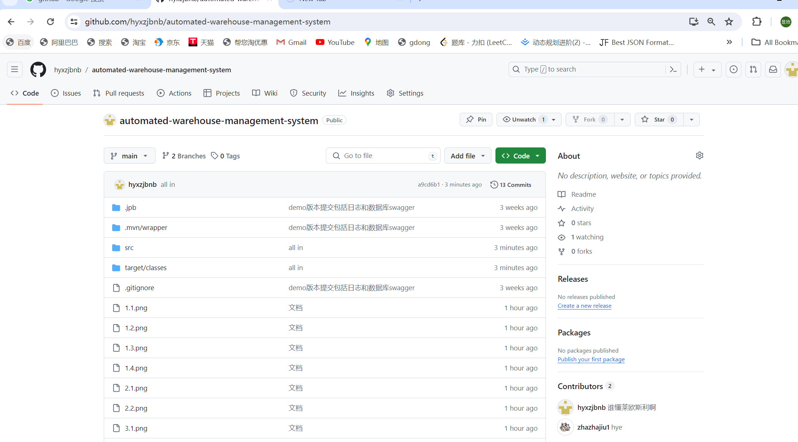

项目地址：
https://github.com/hyxzjbnb/automated-warehouse-management-system.git


## 使用技术

### 技术概要

- **Spring Boot**：基于 Spring 框架的快速开发应用程序的框架。
- **Spring Data JPA**：Spring Data 项目的一部分，简化了 JPA 的数据访问层开发。
- **Spring Boot Starter Validation**：用于在 Spring Boot 中进行数据验证的库。
- **Spring Boot Starter Data REST**：基于 Spring Data REST 的库，简化了 RESTful API 的开发。
- **Spring Boot Starter Web**：用于构建 Web 应用程序的 Spring Boot Starter。
- **Lombok**：用于简化 Java 代码的库，提供了诸如自动生成 Getter、Setter、构造函数等功能。
- **JUnit**：用于编写单元测试的 Java 测试框架。
- **Mockito**：用于模拟对象以进行单元测试的 Java 框架。
- **Java JWT (Auth0)**：用于在 Java 应用程序中创建和验证 JSON Web Tokens (JWT) 的库。
- **H2 Database**：内存数据库，用于开发和测试目的。
- **MySQL Connector/J**：MySQL 的官方 JDBC 驱动程序，用于与 MySQL 数据库进行连接。
- **Log4j**：Java 应用程序的日志记录框架。
- **MyBatis Spring Boot Starter**：简化了在 Spring Boot 应用程序中使用 MyBatis 持久层框架。
- **Druid Spring Boot Starter**：将阿里巴巴 Druid 数据库连接池集成到 Spring Boot 应用程序中。
- **Spring Boot Starter Cache**：Spring Boot 的缓存支持库，用于集成缓存功能。
- **Spring Boot Starter Data Redis**：Spring Boot 的 Redis 支持库，用于与 Redis 数据库进行集成。
- **Swagger/OpenAPI**：用于创建、维护和使用 API 文档的开放标准。

### 工具和插件

- **Maven**：Java 项目的依赖管理和构建工具。
- **Hutool**：Java 工具类库，提供了大量的工具方法，简化了 Java 编程。
- **Spring Boot Maven Plugin**：Spring Boot 项目的 Maven 插件，用于构建和打包 Spring Boot 应用程序。
- **Maven Compiler Plugin**：Maven 编译插件，用于配置项目的 Java 编译版本。


### 初始化应用程序的技术详解

#### MyApplicationRunner

- **技术说明**：
  - `MyApplicationRunner` 类实现了 Spring Boot 的 `ApplicationRunner` 接口，这意味着在 Spring Boot 应用程序启动完成后，`run` 方法会被自动调用。

- **应用场景**：
  - 适用于在应用程序启动完成后执行一些初始化操作，例如打印日志信息、加载配置等。

#### MyCommandLineRunner

- **技术说明**：
  - `MyCommandLineRunner` 类实现了 Spring Boot 的 `CommandLineRunner` 接口，这意味着在 Spring Boot 应用程序启动完成后，`run` 方法会被自动调用。

- **应用场景**：
  - 适用于在应用程序启动完成后执行一些命令行操作，例如加载数据、初始化资源等。

#### SpringBootStartListener

- **技术说明**：
  - `SpringBootStartListener` 类实现了 Spring 的 `ApplicationListener` 接口，用于监听应用程序启动事件。

- **应用场景**：
  - 适用于在应用程序启动过程中监听特定的事件，并执行相应的操作。

#### SpringStartInit

- **技术说明**：
  - `SpringStartInit` 类使用了 `@PostConstruct` 注解，该注解表示在对象构造完成后立即执行初始化操作。

- **应用场景**：
  - 适用于在对象构造完成后执行一些初始化操作，例如初始化资源、加载配置等。

#### DataSourceInitializer

- **技术说明**：
  - `DataSourceInitializer` 类实现了 Spring Boot 的 `CommandLineRunner` 接口，用于在应用程序启动时初始化数据库。

- **应用场景**：
  - 适用于在应用程序启动时自动初始化数据库，并填充初始数据，以确保应用程序能够正常运行。


### 配置类技术详解

#### CacheConfig

- **技术说明**：
   - `CacheConfig` 类使用了 `@Configuration` 和 `@EnableCaching` 注解，标识该类是一个配置类，并启用了 Spring 的缓存功能。
   - 通过 `RedisCacheManager` 实例化了一个 Redis 缓存管理器，并配置了缓存的有效期、是否缓存空值以及序列化方式。

- **应用场景**：
   - 适用于配置应用程序中的缓存管理器，以提高系统性能和响应速度。

#### MyInterceptorConfiguration

- **技术说明**：
   - `MyInterceptorConfiguration` 类实现了 `WebMvcConfigurer` 接口，用于配置 Spring MVC 的拦截器。
   - 通过 `@Value` 注解注入了一个布尔类型的属性，用于控制拦截器的开关。
   - 通过 `addInterceptors` 方法注册了拦截器，并配置了拦截的路径。

- **应用场景**：
   - 适用于在应用程序中配置拦截器，实现权限控制、请求限流等功能。

#### MyUtilsConfiguration

- **技术说明**：
   - `MyUtilsConfiguration` 类使用了 `@Configuration` 注解，标识该类是一个配置类。
   - 通过 `@Bean` 注解配置了两个 Bean，分别是 `MyJwtUtil` 和 `TokenBucket`，用于生成 JWT 令牌和实现令牌桶算法。

- **应用场景**：
   - 适用于配置应用程序中的通用工具类，例如 JWT 工具类和限流算法工具类。

#### SwaggerConfig

- **技术说明**：
   - `SwaggerConfig` 类使用了 `@Configuration` 注解，标识该类是一个配置类。
   - 通过 `@Bean` 注解配置了两个 Bean，分别是 `orderGlobalOpenApiCustomizer` 和 `customOpenAPI`，用于配置 Swagger 文档的全局参数和自定义 OpenAPI 信息。

- **应用场景**：
   - 适用于配置 Swagger 文档，定义 API 的信息和路径，并且可以通过扩展自定义一些额外的信息。


### 工具类技术详解

#### TokenBucket

- **技术说明**：
   - `TokenBucket` 类是一个令牌桶算法的实现，用于限流。它包含了两个属性，`capacity` 表示令牌桶的容量，`tokens` 表示当前令牌数量。
   - `allowRequest` 方法用于判断是否允许请求，当令牌桶中有可用的令牌时，会消耗一个令牌并返回 true；否则返回 false。
   - `refill` 方法用于重新填满令牌桶。

- **应用场景**：
   - 适用于实现限流功能，控制系统的访问速率，防止系统被过多请求拥堵或崩溃。

#### MyJwtUtil

- **技术说明**：
   - `MyJwtUtil` 类是一个 JWT 工具类，用于生成和解析 JWT 令牌。
   - 使用了 `auth0.jwt` 库来实现 JWT 的生成和解析。
   - `createToken` 方法用于生成 JWT 令牌，可以设置过期时间。
   - `decodeToken` 方法用于解析 JWT 令牌，返回令牌中包含的用户信息。

- **应用场景**：
   - 适用于实现身份验证和授权功能，生成和解析 JWT 令牌，用于在客户端和服务端之间传递身份信息。

### 领域类技术详解

#### LoginDomain

- `LoginDomain` 类用于表示登录请求的领域对象。
- 它包含了用户名和密码两个属性，分别用于表示用户的身份信息。
- 使用了 `@NotBlank` 注解来确保用户名和密码不为空。
- 通过 `@Schema` 注解提供了一些关于字段的描述信息，比如默认值和必填属性。

#### RegisterDomain

- `RegisterDomain` 类用于表示注册请求的领域对象。
- 它包含了用户名、密码、确认密码、邮箱和电话等属性，用于表示用户注册时填写的信息。
- 使用了 `@NotBlank` 注解来确保用户名、密码和确认密码不为空，使用 `@Email` 注解来确保邮箱格式正确。
- 通过 `@Schema` 注解提供了一些关于字段的描述信息，比如默认值。

#### DevMessage

- `DevMessage` 类用于表示开发者消息，主要用于在调试和开发过程中输出调试信息。
- 它包含了消息内容和数据两个属性。
- 提供了两个构造方法，一个是传入数据对象，另一个是传入消息内容和数据对象。

#### Result

- `Result` 类用于表示操作结果，包含了成功标志、消息、数据和错误列表等属性。
- 提供了静态方法用于创建成功或失败的结果对象，并提供了添加错误和开发者消息的方法。
- 这个类的设计使得可以统一规范API接口的返回格式，并方便地处理错误信息。

#### TResult

- `TResult` 类是对 `Result` 类的泛型扩展，可以指定返回数据的类型。
- 与 `Result` 类类似，包含了成功标志、消息、数据和错误列表等属性，以及创建成功或失败结果对象和添加错误信息的方法。

通过自定义的domain和Result使得项目具有良好的可读性、可维护性和扩展性，能够更好地满足业务需求。

### 三层架构技术详解

基于Spring Boot的三层架构应用，包括控制器层（Controller）、服务层（Service）、数据访问层（Repository）：

1. **控制器层（Controller）**：
   控制器层负责接收来自客户端的HTTP请求，并将请求委派给服务层进行处理。在这个例子中，`Controller`是控制器类。它使用了Spring的`@RestController`注解，表明这是一个RESTful风格的控制器，并使用`@RequestMapping`注解指定了控制器的基本路径为。控制器中的各个方法分别对应不同的HTTP请求方法（POST、PATCH、DELETE、GET），并通过`@Operation`注解提供了对每个操作的描述。

2. **服务层（Service）**：
   服务层包含了应用的业务逻辑，负责处理来自控制器的请求，并与数据访问层进行交互。在这个例子中，`Service`是服务类。它包含了一系列的业务方法，如创建订单、更新订单状态、取消订单等。每个方法都使用了`@Transactional`注解来确保方法内部的操作在一个事务中执行，以保证数据的一致性和完整性。在服务层中，还可以进行一些业务逻辑的处理，比如对订单状态的判断、库存的更新等。

3. **数据访问层（Repository）**：
   数据访问层负责与数据库进行交互，执行数据的持久化操作。在这个例子中，`Repository`是数据访问接口，继承自Spring Data JPA的`JpaRepository`。Spring Data JPA简化了与数据库的交互，通过一些命名规则，可以根据方法名自动生成SQL查询语句。`Repository`定义了一些查询方法，如根据用户ID和订单状态查询订单，根据用户ID查询订单等。

### 实现功能总结

### 基本需求
1. **定义和文档化一套Restful API**：(down)
   - 在进行程序编写前使用工具分析并制作了合理的api文档，并使用`@RestController`注解，表明这是一个RESTful风格的控制器。
   - api文档，需求分析文档请看附件。

2. **在Java中使用Spring MVC和Boot实现API**：(down)
   - 在项目中利用Spring Boot框架快速搭建和配置项目基础。
   - 在项目中使用Spring MVC来处理HTTP请求和响应。
   下面是代码的实现例子

### ApiProjectApplication.java

```java
package com.example.ex3_2_back;

import org.springframework.boot.SpringApplication;
import org.springframework.boot.autoconfigure.SpringBootApplication;
import org.springframework.cache.annotation.EnableCaching;

@SpringBootApplication
// 开启缓存功能
@EnableCaching
public class ApiProjectApplication {

    public static void main(String[] args) {
        SpringApplication.run(ApiProjectApplication.class, args);
    }

}
```

- 这个类是Spring Boot应用的入口类，使用了`@SpringBootApplication`注解来标识这是一个Spring Boot应用。
- 通过`@EnableCaching`注解开启了缓存功能，在服务中使用Spring的缓存机制。

### MyErrorController.java

```java
package com.example.ex3_2_back.controller;

import com.example.ex3_2_back.domain.Result;
import io.swagger.v3.oas.annotations.Operation;
import org.springframework.boot.web.servlet.error.ErrorController;
import org.springframework.web.bind.annotation.RequestMapping;
import org.springframework.web.bind.annotation.RestController;

@RestController
public class MyErrorController implements ErrorController {

    @RequestMapping("/error")
    @Operation(summary = "返回error", description = "返回error")
    public Result error() {
        return Result.error("error from " + getClass().getName());
    }

}
```

- 这个类是一个控制器，实现了`ErrorController`接口，用于处理全局的错误请求。
- 通过`@RequestMapping("/error")`注解，指定了处理错误请求的路径为"/error"。
- `@Operation`注解提供了对该操作的描述。
- `error`方法返回一个自定义的`Result`对象，表示出现了错误，并提供了错误的详细信息。

3. **实现数据仓储层至少使用关系型数据库管理系统(RDBMS)**：(down)
   - 以下是数据库设计
   - 数据库设计
       - 入库货物表 (InboundItems)
   
     | Column Name    | Data Type | Constraints                      |
     |----------------|-----------|----------------------------------|
     | inboundItemId  | Integer   | Not null, Auto-increment        |
     | inboundTaskId  | Integer   | Foreign Key (InboundTasks)     |
     | productId      | Integer   | Foreign Key (Products)         |
     | quantity       | Integer   | Not null                        |
     | productionDate | Date      | Not null                        |

       - 入库任务表 (InboundTasks)

     | Column Name   | Data Type     | Constraints              |
     |---------------|---------------|--------------------------|
     | inboundTaskId | Integer       | Not null, Auto-increment|
     | status        | String (50)   | Not null                 |
     | createdAt     | DateTime      | Not null                 |
     | updatedAt     | DateTime      | Not null                 |

       - 库存表 (Inventory)

     | Column Name   | Data Type   | Constraints                |
     |---------------|-------------|----------------------------|
     | inventoryId   | Integer     | Not null, Auto-increment  |
     | productId     | Integer     | Foreign Key (Products)    |
     | quantity      | Integer     | Not null                   |
     | lastUpdated   | DateTime    | Not null                   |

       - 订单表 (Orders)

     | Column Name   | Data Type    | Constraints                 |
     |---------------|--------------|-----------------------------|
     | orderId       | Integer      | Not null, Auto-increment   |
     | customerId    | Integer      | Foreign Key (Users)        |
     | status        | String (50)  | Not null                    |
     | createdAt     | DateTime     | Not null                    |
     | updatedAt     | DateTime     | Not null                    |

       - 订单异常表 (OrderExceptions)

     | Column Name   | Data Type    | Constraints                |
     |---------------|--------------|----------------------------|
     | exceptionId   | Integer      | Not null, Auto-increment  |
     | orderId       | Integer      | Foreign Key (Orders)       |
     | description   | String (500) | Not null                   |
     | createdAt     | DateTime     | Not null                   |

       - 订单商品表 (OrderItems)

     | Column Name   | Data Type  | Constraints               |
     |---------------|------------|---------------------------|
     | orderItemId   | Integer    | Not null, Auto-increment |
     | orderId       | Integer    | Foreign Key (Orders)      |
     | productId     | Integer    | Foreign Key (Products)    |
     | quantity      | Integer    | Not null                  |

       - 出库货物表 (OutboundItems)

     | Column Name     | Data Type | Constraints                       |
     |-----------------|-----------|-----------------------------------|
     | outboundItemId  | Integer   | Not null, Auto-increment         |
     | outboundTaskId  | Integer   | Foreign Key (OutboundTasks)      |
     | itemId          | Integer   | Foreign Key (InboundItems)       |
     | quantity        | Integer   | Not null                         |

       - 出库任务表 (OutboundTasks)

     | Column Name     | Data Type   | Constraints                     |
     |-----------------|-------------|---------------------------------|
     | outboundTaskId  | Integer     | Not null, Auto-increment       |
     | orderId         | Integer     | Foreign Key (Orders)            |
     | status          | String (50) | Not null                        |
     | createdAt       | DateTime    | Not null                        |
     | updatedAt       | DateTime    | Not null                        |

       - 产品表 (Products)

     | Column Name    | Data Type    | Constraints                   |
     |----------------|--------------|-------------------------------|
     | productId      | Integer      | Not null, Auto-increment     |
     | name           | String (100) | Not null                      |
     | description    | String (255) |                               |
     | price          | Decimal      | Not null                      |
     | productionDate | Date         |                               |

       - 用户表 (Users)

     | Column Name | Data Type | Constraints                  |
     |-------------|-----------|------------------------------|
     | id          | Integer   | Not null, Auto-increment    |
     | name        | String    | Unique, Not null             |
     | password    | String    |                              |
     | email       | String    | Valid Email Address          |
     | phone       | String    |                              |
     | address     | String    |                              |

       - 员工表 (Workers)

     | Column Name | Data Type | Constraints                 |
     |-------------|-----------|-----------------------------|
     | id          | Long      | Not null, Auto-increment   |
     | name        | String    |                             |
     | password    | String    |                             |
     | role        | String    |                             |

   - 选择了mysql作为数据存储层
   - 使用配置项在项目初始化的时候自动加载连接并初始化数据库
```yaml
spring:
  jpa:
    database: mysql
    hibernate:
      ddl-auto: update
    database-platform:
  datasource:
    url: jdbc:mysql://localhost:3306/warehouse_test?serverTimezone=GMT%2B8
    name: root
    password: "xxxxxxxxxxxxx"
    username: root
```
   - 在entity层实现实体类，下面是实现实体类的例子
```java
package com.example.ex3_2_back.entity;

import jakarta.persistence.*;
import lombok.*;
import java.time.LocalDateTime;

@Builder
@Getter
@Setter
@NoArgsConstructor
@AllArgsConstructor
@ToString
@Entity
@Table(name = "Orders")
public class Order {
    @Id
    @GeneratedValue(strategy = GenerationType.IDENTITY)
    @Column(nullable = false, updatable = false)
    Integer orderId;

    @ManyToOne
    @JoinColumn(name = "customerId", nullable = false)
    private User customer;

    @Column(nullable = false, length = 50)
    private String status;

    @Column(nullable = false)
    private LocalDateTime createdAt;

    @Column(nullable = false)
    private LocalDateTime updatedAt;

}
```
- **使用Jakarta Persistence API (JPA):** 
  - 通过JPA的注解，如`@Entity`、`@Table`、`@Id`、`@GeneratedValue`、`@Column`、`@ManyToOne`、`@JoinColumn`，来定义实体类和实体类之间的关系，以及属性与数据库字段之间的映射关系。

- **Lombok:**
  - Lombok通过注解自动生成Java代码，通过在实体类上添加注解，如`@Getter`、`@Setter`、`@NoArgsConstructor`、`@AllArgsConstructor`、`@ToString`、`@Builder`，自动生成相应的方法或构造函数。

- **Spring Data JPA:**
  - 使用Spring Data JPA的特性，与Spring Data JPA无缝集成，使数据访问更加方便。


4. **使用Boot测试框架和Web API进行测试**：(down)
   - 使用了Spring Boot提供的测试框架进行自动化测试，下面是一个测试代码的例子
```java
@WebMvcTest(OrderController.class)
public class OrderControllerTests {
    @Autowired
    private MockMvc mockMvc;
    @MockBean
    private OrderService orderService;
    @Autowired
    private ObjectMapper objectMapper;
    private Order order;

    @BeforeEach
    void setUp() {
        order = new Order();
        order.setId(1);
        order.setStatus("Pending");
        order.setCreatedAt(LocalDateTime.now());
        order.setUpdatedAt(LocalDateTime.now());
    }

    @Test
    void testCreateOrder() throws Exception {
        when(orderService.createOrder(any(Order.class))).thenReturn(order);

        mockMvc.perform(post("/orders")
                        .contentType(MediaType.APPLICATION_JSON)
                        .content(objectMapper.writeValueAsString(order)))
                .andExpect(status().isOk())
                .andExpect(jsonPath("$.data.status").value("Pending"));
    }

}
```
**单元测试**：
- 针对每个API端点进行测试，例如`testCreateOrder`测试创建订单功能。
- 使用Mockito框架模拟服务层行为，验证控制器行为是否符合预期。
- 在每个测试方法中，模拟调用服务层方法，例如`when(orderService.createOrder(any(Order.class)))`模拟订单服务的`createOrder`方法。

**集成测试**：
- 使用Spring Boot提供的`@WebMvcTest`注解进行集成测试，启动Spring MVC应用程序，模拟HTTP请求和响应。
- 使用`MockMvc`对象模拟HTTP请求，验证控制器的响应是否符合预期。
- 例如，测试方法中模拟POST请求发送到`/orders`端点，并验证响应状态码为200，订单状态为"Pending"。

**验证API的功能和性能**：
- 验证特定API端点的功能，例如创建订单、更新订单状态、获取订单列表、取消订单等。
- 使用`MockMvc`对象发送HTTP请求，验证响应结果是否符合预期，确保API在不同情况下的响应和处理逻辑正确。


   - 使用了swagger UI 进行手动测试

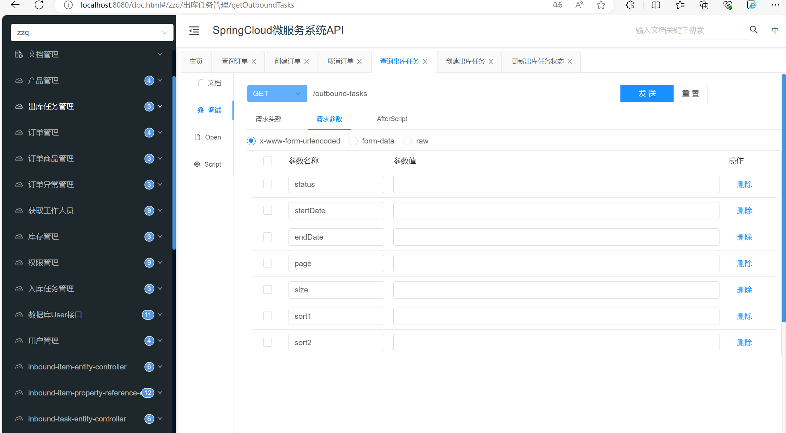

5. **API认证**：(down)
   - 使用JWT实现了权限控制,使得使用接口的命令必须是已经注册登入的用户，并设置Interceptor分别拦截用户支持和管理员支持的接口
   - 同时在util类里实现了自定义的方法参数解析器 CurrentUserResolver，注解 @LoginRequired 和 @CurrentUser 用来更好的支持
```java

@Service
@Slf4j
public class AuthService {
    private UserRepository userRepository;

    private MyJwtUtil jwtUtil;

    @Autowired
    public void setUserRepository(UserRepository userRepository) {
        this.userRepository = userRepository;
    }

    @Autowired
    public void setJwtUtil(MyJwtUtil jwtUtil) {
        this.jwtUtil = jwtUtil;
    }

    @NotNull
    public Result login(@NotNull LoginDomain loginDomain, @NotNull HttpServletResponse response) {
    }

    @NotNull
    public Result register(@NotNull RegisterDomain registerDomain) {
    }

    /**
     * 设置token
     *
     * @param username 用户名
     * @param response 当次的响应
     */
    public void setTokenCookie(String username, @NotNull HttpServletResponse response) {
    }

    /**
     * 清除token
     *
     * @param response 当次的响应
     */
    public void removeTokenCookie(@NotNull HttpServletResponse response) {

    }

    /**
     * 检查token的有效性并更新token
     *
     * @param request  当次的请求
     * @param response 当次的响应
     * @return 结果
     */
    @NotNull
    public Result validateAndUpdateToken(@NotNull HttpServletRequest request, @NotNull HttpServletResponse response) {

    }
```

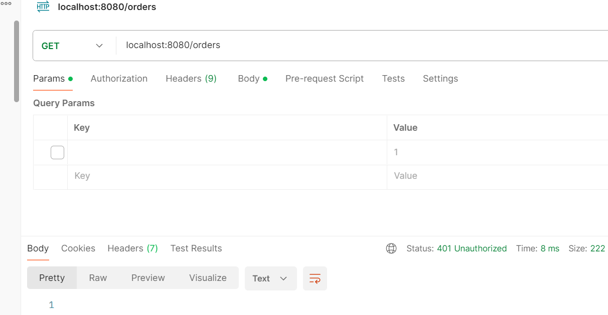
### 额外实现（加分项）
1. **缓存（Caching）**：(down)
   - 使用redis缓存，减少数据库访问次数，提高应用性能。
```yaml
# Redis连接配置
    redis:
      database: 0
      host: 127.0.0.1
      port: 6379
      timeout: 2000
      lettuce:
        pool:
          max-active: 8
          max-wait: -1
          max-idle: 8
          min-idle: 0
```
```java
@Configuration
@EnableCaching
public class CacheConfig {
    @Bean
    @SuppressWarnings("all")
    public RedisCacheManager cacheManager(RedisConnectionFactory connectionFactory) {
        RedisCacheConfiguration cacheConfig = RedisCacheConfiguration.defaultCacheConfig()
                .entryTtl(Duration.ofHours(1))  // 设置缓存有效期一小时
                .disableCachingNullValues()   // 不缓存空值
                .serializeValuesWith(RedisSerializationContext.SerializationPair.fromSerializer(new GenericJackson2JsonRedisSerializer()));

        return RedisCacheManager.builder(connectionFactory)
                .cacheDefaults(cacheConfig)
                .build();
    }
    
```
```java
@Service
@Slf4j
public class ProductService {

    @Autowired
    private ProductRepository productRepository;

    /**
     * Retrieves a product by its id, caching the result.
     * @param productId The id of the product to retrieve.
     * @return The requested product.
     */
    @Cacheable(value = "products", key = "#productId")
    public Product getProductById(Integer productId) {
        return productRepository.findById(productId).orElseThrow(() -> new IllegalArgumentException("Product not found with ID: " + productId));
    }

    /**
     * Updates a product and caches the new result.
     * @param product The product to update.
     * @return The updated product.
     */
    @CachePut(value = "products", key = "#product.id")
    @Transactional
    public Product updateProduct(Product product) {
        Product updatedProduct = productRepository.save(product);
        return updatedProduct;
    }

    /**
     * Evicts a specific product from the cache.
     * @param productId The id of the product to evict from the cache.
     */
    @CacheEvict(value = "products", key = "#productId")
    public void evictProductFromCache(Long productId) {
        // This method will automatically remove the item from cache.
    }

    /**
     * Deletes a product and its cache.
     * @param productId The id of the product to delete.
     */
    @CacheEvict(value = "products", key = "#productId")
    @Transactional
    public void deleteProduct(Integer productId) {
        productRepository.deleteById(productId);
    }
}
```
- `@Cacheable`：这个注解标注在`getProductById`方法上，表示当方法被调用时，Spring会先检查缓存中是否已经存在相应的产品数据。如果存在，则直接从缓存中返回数据，而不执行方法体内的代码。如果缓存中不存在对应的数据，则会执行方法体内的代码，并将结果存入缓存以备将来使用。

- `@CachePut`：这个注解标注在`updateProduct`方法上，表示当方法被调用时，无论缓存中是否已存在相应的数据，都会执行方法体内的代码，并将方法返回的结果存入缓存中。这样可以保证缓存中的数据与数据库中的数据保持同步。

- `@CacheEvict`：这个注解标注在`evictProductFromCache`和`deleteProduct`方法上，用于从缓存中移除数据。在`evictProductFromCache`方法中，它会根据指定的产品ID从缓存中移除对应的数据；而在`deleteProduct`方法中，除了从缓存中移除数据外，还会从数据库中删除对应的产品数据。
   

2. **会话控制（Session Control）**：(down)
   - 通过JWT实现会话控制
```java
@Component
@Slf4j
public class MyJwtUtil {
    private final Algorithm algorithm = Algorithm.HMAC256("secret");

    public String createToken(String username) {
        return createToken(username, 60 * 1000);
    }

    private static final String identityKey = "t-username";

    public Optional<String> decodeToken(String token) {
    }

    public String createToken(String username, int seconds) {

    }
}
```
```java
/**
     * 检查token的有效性并更新token
     *
     * @param request  当次的请求
     * @param response 当次的响应
     * @return 结果
     */
    @NotNull
    public Result validateAndUpdateToken(@NotNull HttpServletRequest request, @NotNull HttpServletResponse response) {
        var cookies = request.getCookies();

        if (cookies == null || cookies.length == 0) {
            response.setStatus(HttpServletResponse.SC_UNAUTHORIZED);
            var message = String.format("%s: No token in cookie", request.getRequestURL());
            log.info(message);
            return Result.error(message);
        }

        Optional<Cookie> optionalCookie = Arrays.stream(cookies).filter(cookie -> cookie.getName().equals("token")).findAny();
        String token = optionalCookie.map(Cookie::getValue).orElse("");

        log.info(String.format("old token: %s", token));
        var optionalUsername = jwtUtil.decodeToken(token);

        if (optionalUsername.isEmpty()) {
            response.setStatus(HttpServletResponse.SC_UNAUTHORIZED);
            var message = String.format("%s: No username in token", request.getRequestURL());
            log.info(message);
            return Result.error(message);
        }

        var username = optionalUsername.get();
        request.setAttribute("username", username);
        setTokenCookie(username, response);

        return Result.success();
    }
```
1. `MyJwtUtil` 类：

   - `createToken(String username)`: 这个方法用于创建JWT令牌。它接收一个用户名作为参数，并生成一个JWT令牌，有效期默认为60秒。
   
   - `createToken(String username, int seconds)`: 这个方法重载了上一个方法，允许指定JWT令牌的有效期，单位为秒。

   - `decodeToken(String token)`: 这个方法用于解码JWT令牌。它接收一个JWT令牌作为参数，并返回一个可选的用户名。如果令牌有效且包含用户名信息，则返回该用户名，否则返回空。

2. `validateAndUpdateToken` 方法：

   这个方法用于检查并更新JWT令牌。它首先从请求中获取名为 "token" 的cookie，然后尝试解码该令牌。如果解码成功，则获取令牌中的用户名，并将用户名存储在请求属性中。如果该令牌未失效，调用 `setTokenCookie` 方法来更新令牌，并返回一个成功的结果。如果解码失败过期或者令牌中不包含用户名信息，则返回一个未经授权的响应。
   这样便可以便捷的实现会话控制

   
3. **日志（Log）**：(down)
   - 使用@Slf4j实现日志管理
```yaml
logging:
  level:
    root: info   # 根日志级别设置为info，将会记录info及以上级别的日志
  file:
    name: app.log   # 指定日志文件名称
  pattern:
    console: "%d{yyyy-MM-dd HH:mm:ss} [%thread] %-5level %logger{36} - %msg%n"   # 指定控制台输出的日志格式
    file: "%d{yyyy-MM-dd HH:mm:ss} [%thread] %-5level %logger{36} - %msg%n"   # 指定日志文件输出的日志格式
  appenders:
    file:
      type: file
      fileName: ${logging.file.name}
      append: true
    console:
      type: console
  loggers:
    com.example.ex3_2_back: debug   # 指定某个包的日志级别为debug
```


1. `@Slf4j` 注解：这是一个Lombok提供的注解，用于自动生成Slf4j的日志记录器（Logger）。

2. `logging` 部分：

   - `level`：指定了根日志级别为 `info`，这意味着只有 `info` 级别及以上的日志信息才会被记录。
   
   - `file`：指定了日志文件的名称为 `app.log`。
   
   - `pattern`：指定了控制台和日志文件输出的日志格式，包括日期、线程名、日志级别、Logger名称、消息等信息。

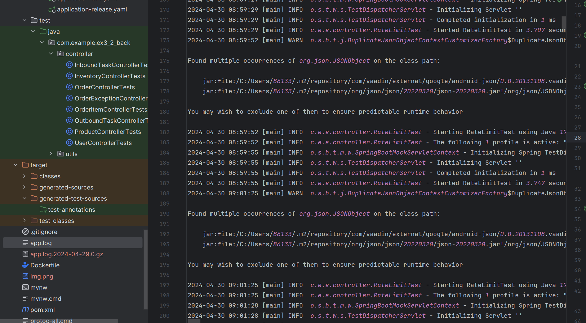

4. **限流（Rate Limiting）**：(down)
   - 使用令牌桶进行限流
```java
import lombok.extern.slf4j.Slf4j;

import java.util.concurrent.atomic.AtomicInteger;
@Slf4j
public class TokenBucket {

    private final int capacity; // 令牌桶容量
    private final AtomicInteger tokens; // 当前令牌数量

    public TokenBucket(int capacity) {
        this.capacity = capacity;
        this.tokens = new AtomicInteger(capacity);
    }

    public boolean allowRequest() {
        while (true) {
            int currentTokens = tokens.get();
            if (currentTokens == 0) {
                return false; // 令牌桶中没有可用的令牌
            }
            if (tokens.compareAndSet(currentTokens, currentTokens - 1)) {
                return true; // 消耗一个令牌
            }
        }
    }

    public void refill() {
        tokens.set(capacity); // 重新填满令牌桶
    }
}
```
```java
import java.lang.annotation.ElementType;
import java.lang.annotation.Retention;
import java.lang.annotation.RetentionPolicy;
import java.lang.annotation.Target;

@Retention(RetentionPolicy.RUNTIME)
@Target(ElementType.METHOD)
public @interface RateLimit {
    int value() default 100; // 默认的令牌桶容量
}
``` 
  - 在annotation中声明RateLimit注释
```java
@Component
public class RateLimitInterceptor implements HandlerInterceptor {

    TokenBucket tokenBucket;

    @Autowired
    public void setRateLimitInterceptor(TokenBucket tokenBucket) {
        this.tokenBucket = tokenBucket;
    }

    @Override
    public boolean preHandle(@NotNull HttpServletRequest request, @NotNull jakarta.servlet.http.HttpServletResponse response, @NotNull Object handler) throws Exception {
        // 在此处检查请求是否超出了速率限制
        if (!tokenBucket.allowRequest()) {
            // 如果超出了速率限制，可以根据实际情况进行处理，例如返回错误信息或者拒绝请求
            response.setStatus(429); // 请求过多，使用状态码 429
            response.getWriter().write("Too many requests"); // 返回自定义的错误信息
            return false;
        }
        return true;
    }
}
```  
  - 同时创建RateLimitInterceptor拦截器
```java
    RateLimitInterceptor rateLimitInterceptor;

    @Autowired
    public void setRateLimitInterceptor(RateLimitInterceptor rateLimitInterceptor) {
        this.rateLimitInterceptor = rateLimitInterceptor;
    }

-----------------------------------------------------
    @Bean
    public TokenBucket tokenBucket() {
        // 在此可以根据需要指定令牌桶的容量
        return new TokenBucket(100); // 假设令牌桶容量为 100
    }
------------------------------------------------------------
        registry.addInterceptor(rateLimitInterceptor)
                .addPathPatterns("/**");
```
  - 在配置类里注入bean，并在MyInterceptorConfiguration调用拦截器
  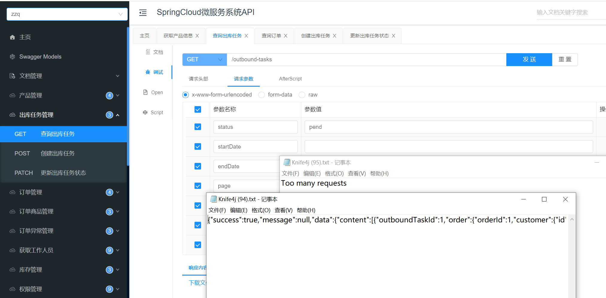

5. **分页实现**：(down)
   - 对于查询操作，实现分页以避免一次性加载过多数据，使用page和size参数来控制输出。
   - 同时使用java jdk自带的pageable实现了sort，可以根据不同属性排序来提高用户使用体验
  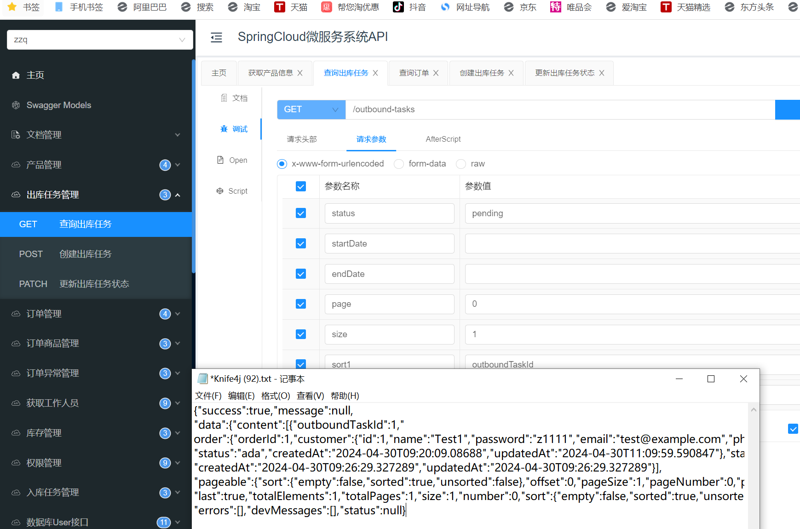
6. **模糊查询实现**：(down)
   - 在specifications类里面实现模糊匹配
```java
public class OutPostSpecifications {
    public static Specification<OutboundTask> hasStatus(String status) {
        return (root, query, cb) -> cb.like(cb.lower(root.get("status")), "%" + status.toLowerCase() + "%");
    }
    public static Specification<OutboundTask> hasStartDate(LocalDateTime startDate) {
        return (root, query, cb) -> cb.greaterThanOrEqualTo(root.get("createdAt"), startDate);
    }

    public static Specification<OutboundTask> hasEndDate(LocalDateTime endDate) {
        return (root, query, cb) -> cb.lessThanOrEqualTo(root.get("createdAt"), endDate);
    }

}
```
   - 在specifications类里面实现模糊匹配
```java
 @Transactional(readOnly = true)
    public Result searchOutPosts(String status, String startDate, String endDate, Pageable pageable) {
        Callable<Result> task = () -> {
            try {
                Specification<OutboundTask> spec = Specification.where(null);

                if (status != null && !status.isEmpty()) {
                    spec = spec.and(OutPostSpecifications.hasStatus(status));
                }
                if (startDate != null && !startDate.isEmpty()) {
                    spec = spec.and(OutPostSpecifications.hasStartDate(LocalDateTime.parse(startDate)));
                }
                if (endDate != null && !endDate.isEmpty()) {
                    spec = spec.and(OutPostSpecifications.hasEndDate(LocalDateTime.parse(endDate)));
                }

                Page<OutboundTask> outboundTasks = outboundTaskRepository.findAll(spec, pageable);
                if (outboundTasks.hasContent()) {
                    return Result.success(outboundTasks);
                } else {
                    return Result.error("没有查到相关资料");
                }
            } catch (Exception e) {
                return Result.error("失败：" + e.getMessage());
            }
        };
        return null;
    }
```
   - 在service类里面调用方法匹配
     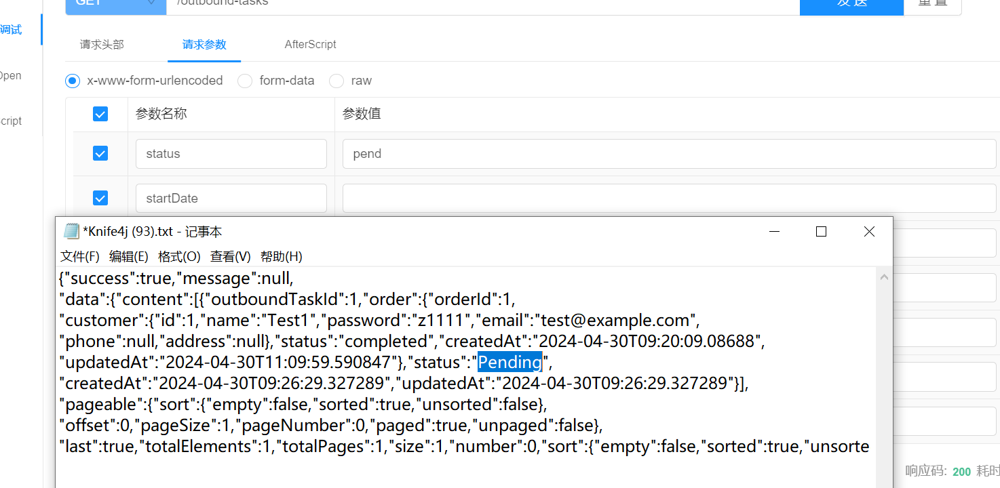
6. **swagger与openapi**：(down)
   - 使用swagger 和 openapi进行api的文档管理,并规范api代码的编写
   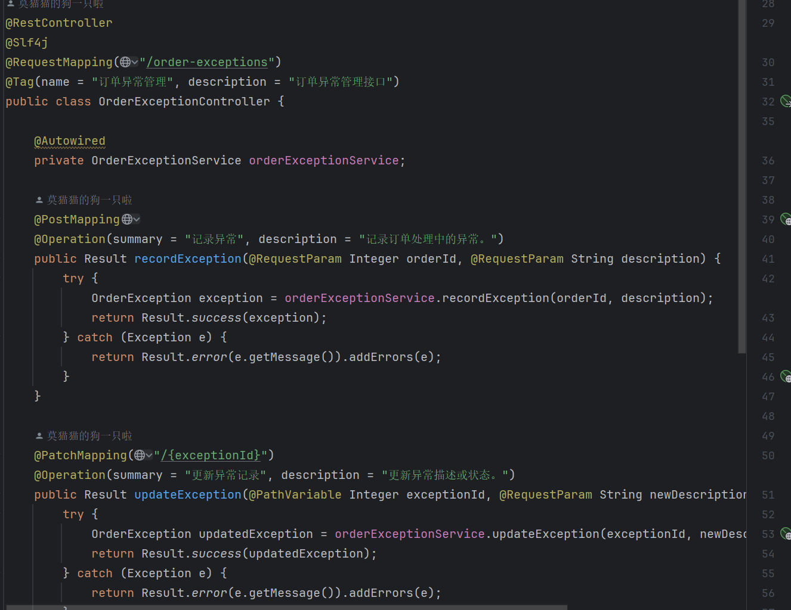
   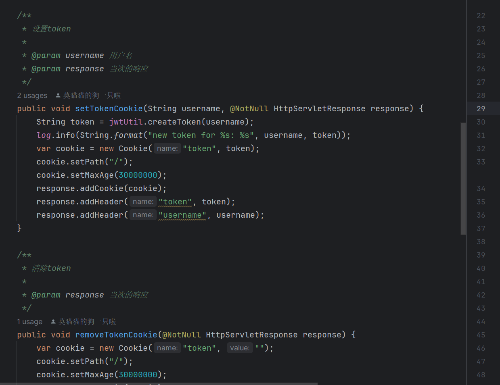

   


## 测试结果
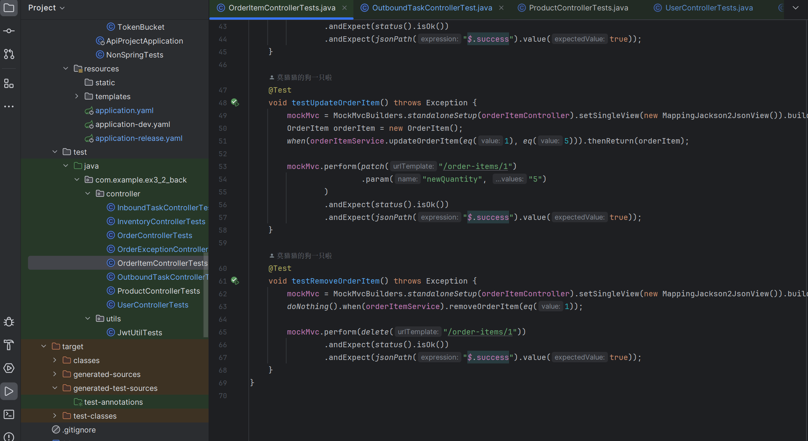
这是我们的spring boot提供的测试框架进行测试的结果，老师可以自动化运行检查
我们配置了h2数据库使得可以便捷进行测试
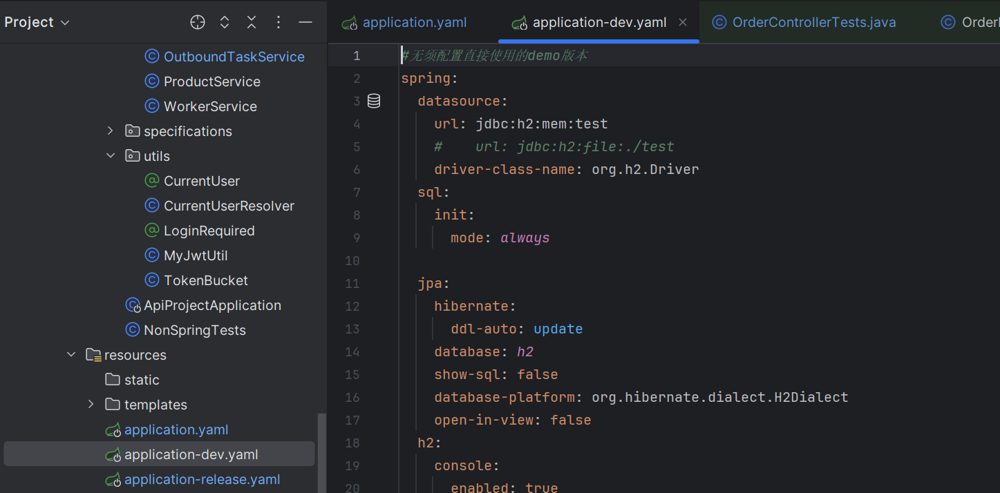
只需要在application里选择dev版本即可（未使用redis版本）
以下是我们手动测试的结果
### Swagger UI
`localhost:8080/doc.html`
### OpenApi
`localhost:8080/v3/api-docs`
### 1. 订单管理 API (down)

#### 创建订单
- **POST /orders**
    - **描述**：创建一个新订单，同时进行库存检查和用户验证。
    - **请求体**：包含用户ID、商品列表（每个商品包括产品ID和数量）。
    - **响应**：订单详情，包括订单ID、订单状态等。
      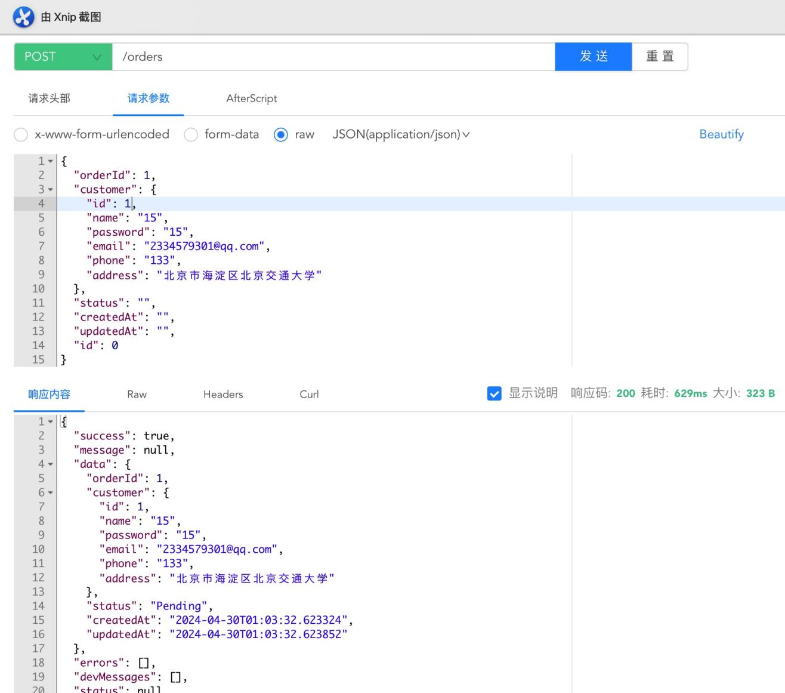
#### 更新订单状态
- **PATCH /orders/{orderId}**
    - **描述**：更新订单的状态。
    - **路径参数**：`orderId` - 订单的唯一标识。
    - **请求体**：包含新的订单状态。
    - **响应**：更新后的订单详情。
      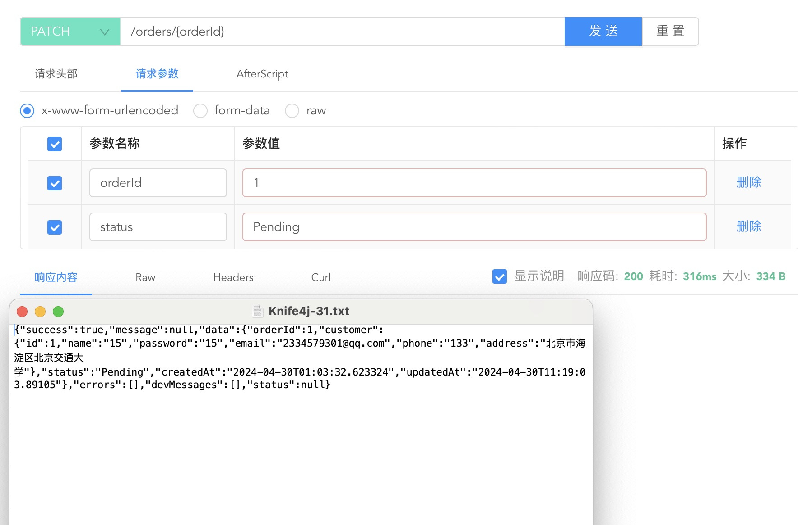
#### 取消订单
- **DELETE /orders/{orderId}**
    - **描述**：取消订单，并回滚库存。
    - **路径参数**：`orderId` - 订单的唯一标识。
    - **响应**：操作结果。
      
#### 查询订单
- **GET /orders**
    - **描述**：根据用户或状态查询订单。
    - **查询参数**：`userId`, `status`。
    - **响应**：符合条件的订单列表。
      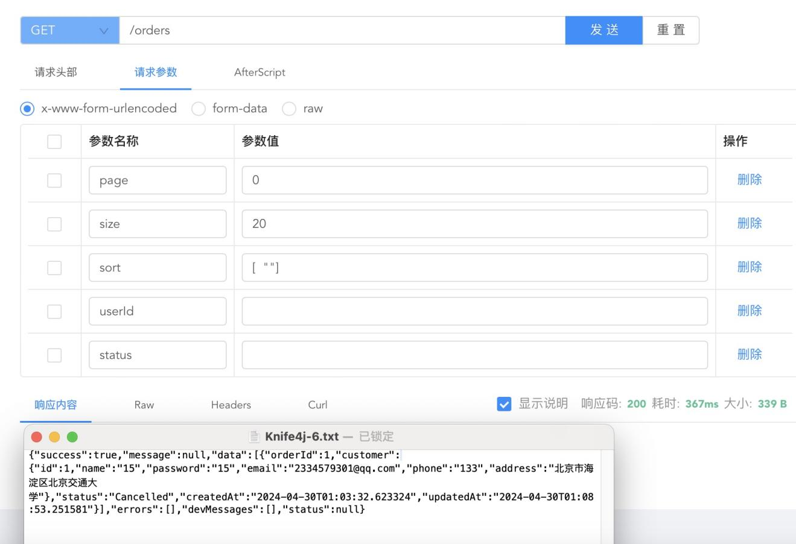
### 2. 订单商品管理 (down)

#### 添加商品到订单
- **POST /order-items**
    - **描述**：为特定订单添加商品。
    - **请求体**：订单ID、商品ID和数量。
    - **响应**：新创建的订单商品条目详情。
      
#### 更新订单商品
- **PATCH /order-items/{orderItemId}**
    - **描述**：更新订单中某个商品的数量。
    - **路径参数**：`orderItemId` - 订单商品条目的唯一标识。
    - **请求体**：新的数量。
    - **响应**：更新后的订单商品条目详情。
      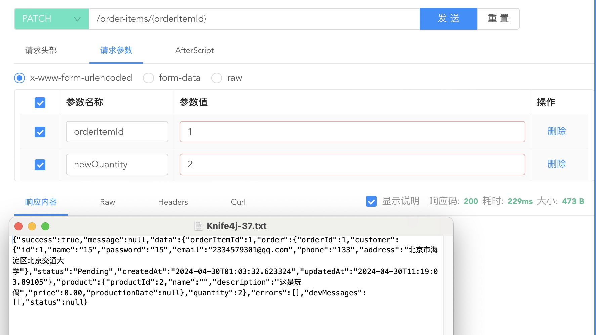
#### 删除订单商品
- **DELETE /order-items/{orderItemId}**
    - **描述**：从订单中删除一个商品，并更新库存。
    - **路径参数**：`orderItemId`。
    - **响应**：操作结果。
      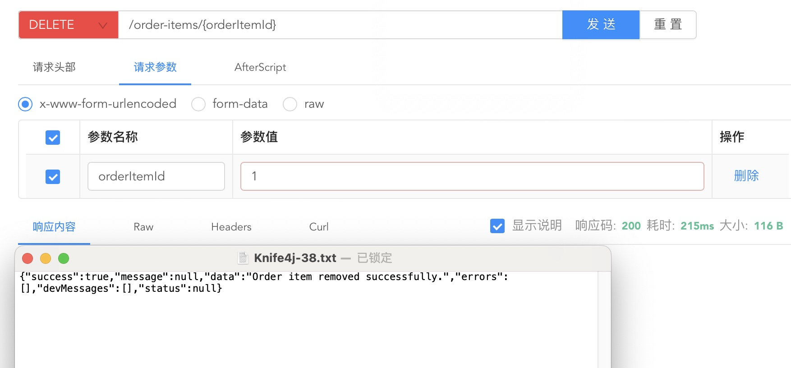
### 3. 订单异常管理 API(down)

#### 记录异常
- **POST /order-exceptions**
    - **描述**：记录订单处理中的异常。
    - **请求体**：订单ID、异常描述。
    - **响应**：异常记录详情。
      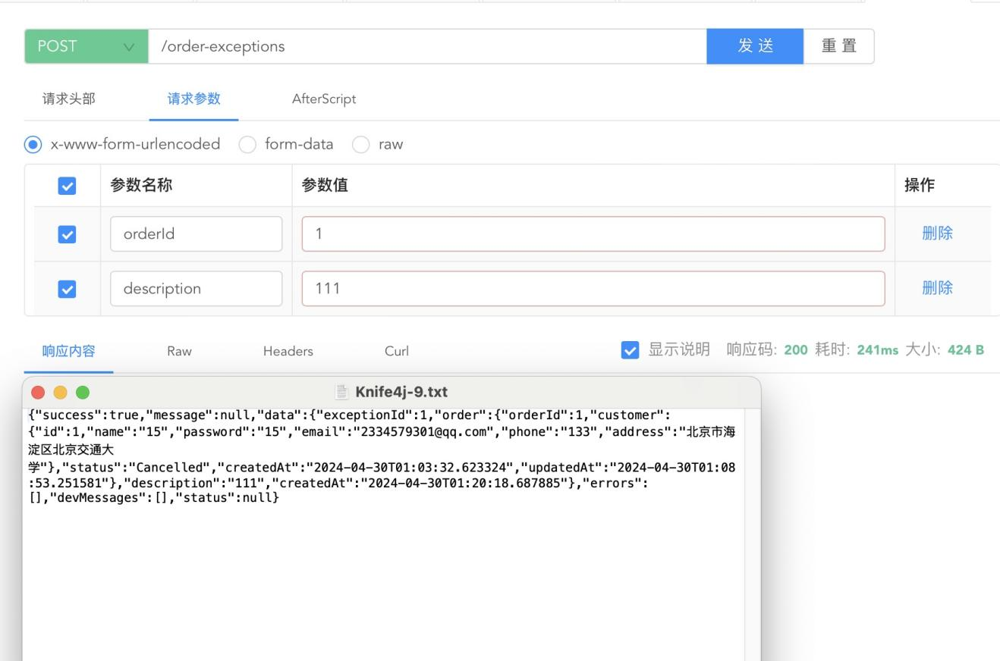
#### 更新异常记录
- **PATCH /order-exceptions/{exceptionId}**
    - **描述**：更新异常描述或状态。
    - **路径参数**：`exceptionId` - 异常记录的唯一标识。
    - **请求体**：新的异常描述或状态。
    - **响应**：更新后的异常记录详情。
      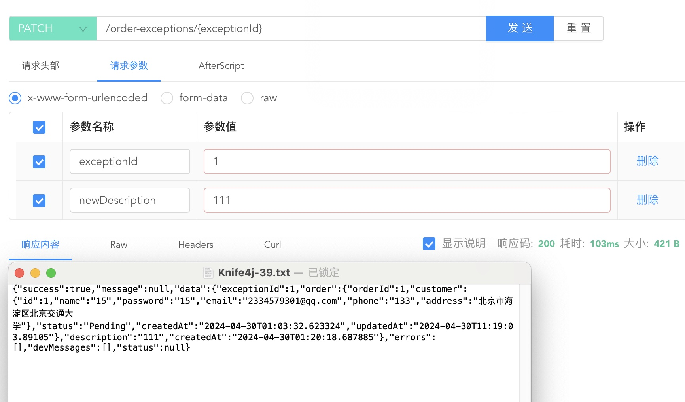
#### 查询异常
- **GET /order-exceptions**
    - **描述**：按订单ID或日期查询异常记录。
    - **查询参数**：`orderId`, `date`。
    - **响应**：异常记录列表。
      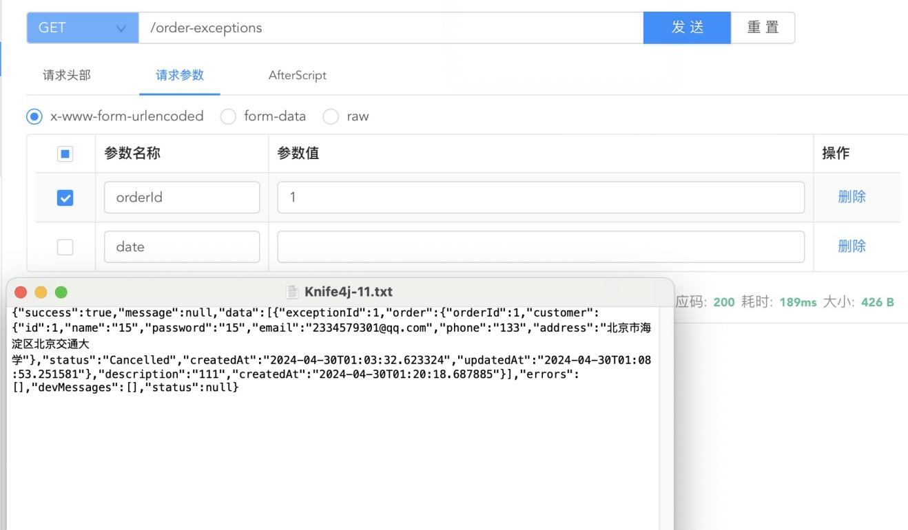
### 4. 入库任务管理 API(DOWN)

#### 创建入库任务
- **POST /inbound-tasks**
    - **描述**：创建一个新的入库任务。
    - **请求体**：相关细节，如员工ID、预定入库时间等。
    - **响应**：入库任务详情。
      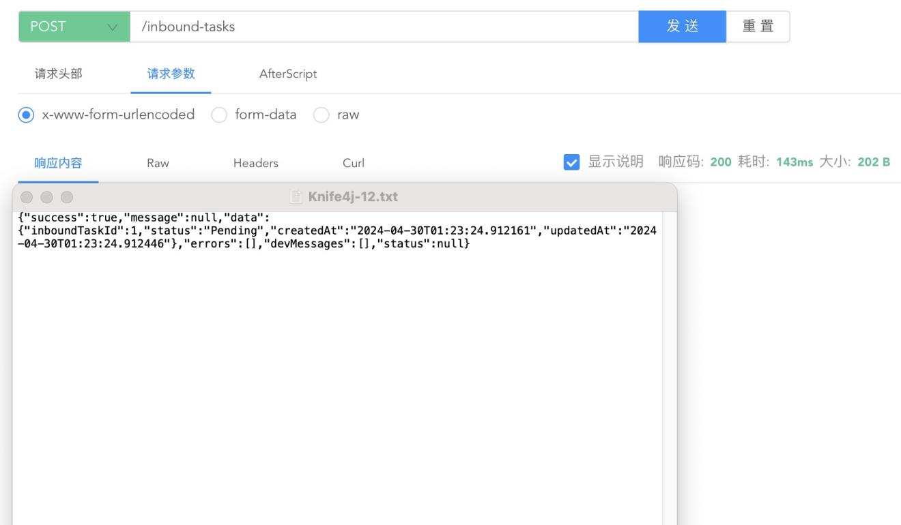
#### 更新入库任务状态
- **PATCH /inbound-tasks/{taskId}**
    - **描述**：更新入库任务的状态。
    - **路径参数**：`taskId`。
    - **请求体**：新的任务状态。
    - **响应**：更新后的任务详情。
      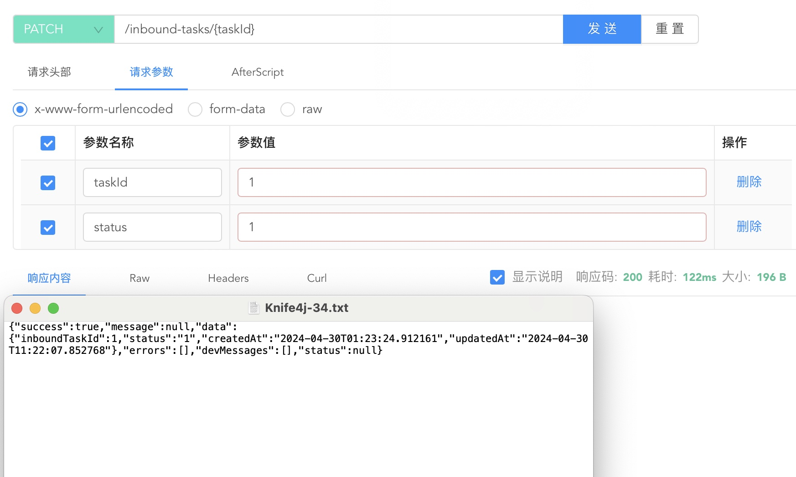
#### 查询入库任务
- **GET /inbound-tasks**
    - **描述**：按状态或日期范围查询入库任务。
    - **查询参数**：`status`, `startDate`, `endDate`。
    - **响应**：符合条件的入库任务列表。

### 5. 出库任务管理 API(down)

#### 创建出库任务
- **POST /outbound-tasks**
    - **描述**：为订单创建出库任务。
    - **请求体**：订单ID、预定出库时间等。
    - **响应**：出库任务详情。
      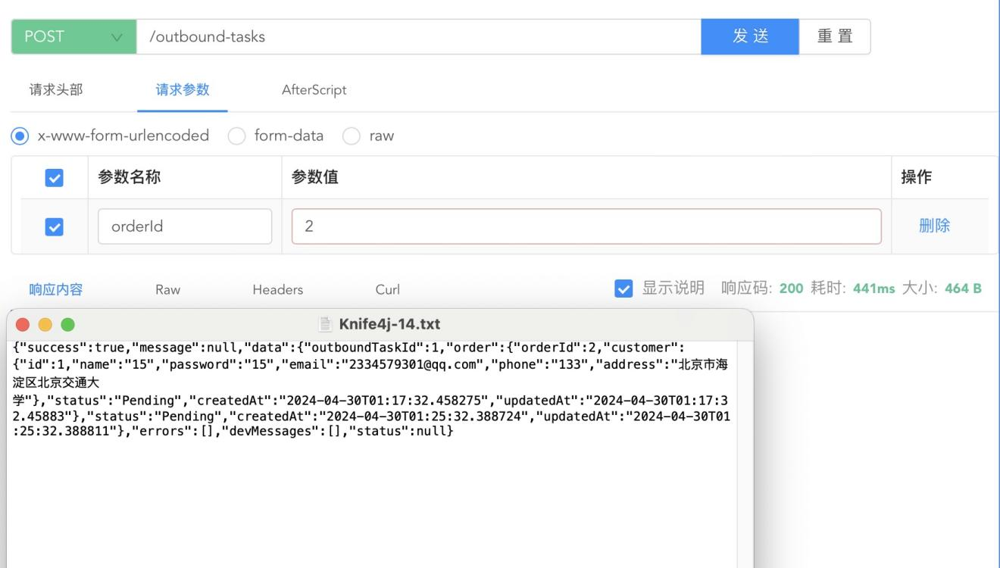
#### 更新出库任务
#### 更新出库任务状态
- **PATCH /outbound-tasks/{taskId}**
    - **描述**：更新出库任务的状态。
    - **路径参数**：`taskId` - 出库任务的唯一标识。
    - **请求体**：包含新的任务状态。
    - **响应**：更新后的出库任务详情。
      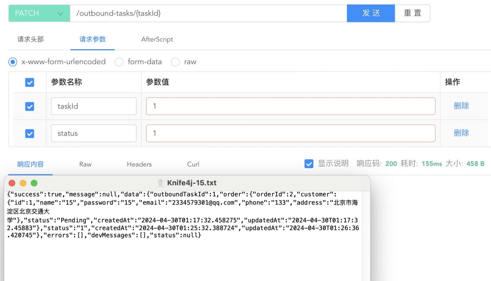
#### 查询出库任务
- **GET /outbound-tasks**
    - **描述**：按状态或日期范围查询出库任务。
    - **查询参数**：`status`, `startDate`, `endDate`。
    - **响应**：符合条件的出库任务列表。
      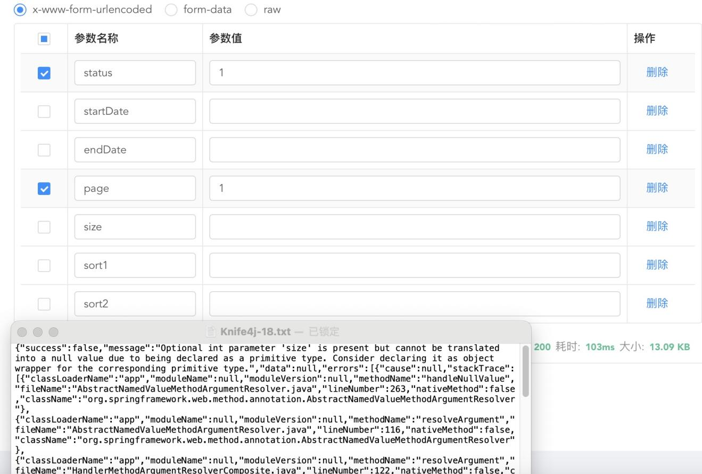
### 6. 库存管理 API

#### 更新库存
- **PATCH /inventory/{productId}**
    - **描述**：更新指定产品的库存数量。
    - **路径参数**：`productId` - 产品的唯一标识。
    - **请求体**：包含库存的增加或减少数量。
    - **响应**：更新后的库存详情。
      
#### 查询库存
- **GET /inventory**
    - **描述**：查询特定产品的当前库存量。
    - **查询参数**：`productId`。
    - **响应**：指定产品的库存详情。
      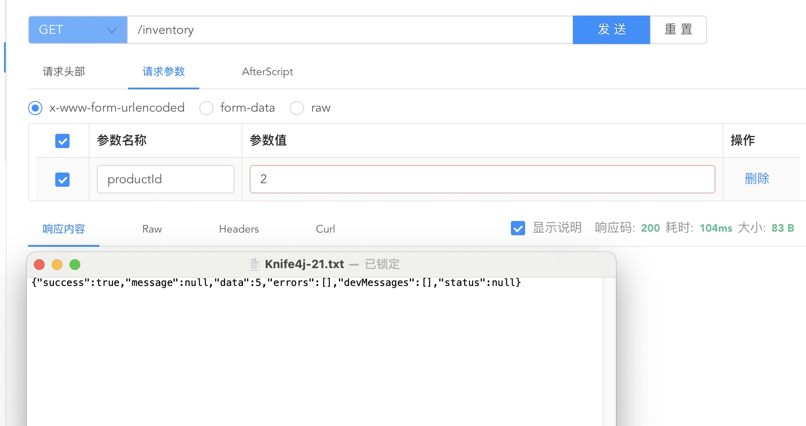
#### 库存警告
- **GET /inventory/warnings**
    - **描述**：查询库存量低于安全水平的所有产品。
    - **响应**：库存警告列表，包括产品ID和当前库存量。
      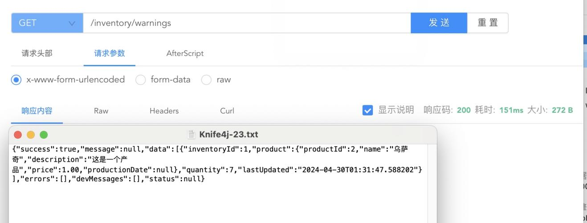
### 7. 产品管理 API(down)

#### 添加产品信息
- **POST /products**
    - **描述**：添加新的产品信息到数据库。
    - **请求体**：包含产品的名称、描述、初始库存量等信息。
    - **响应**：新创建的产品详情。
      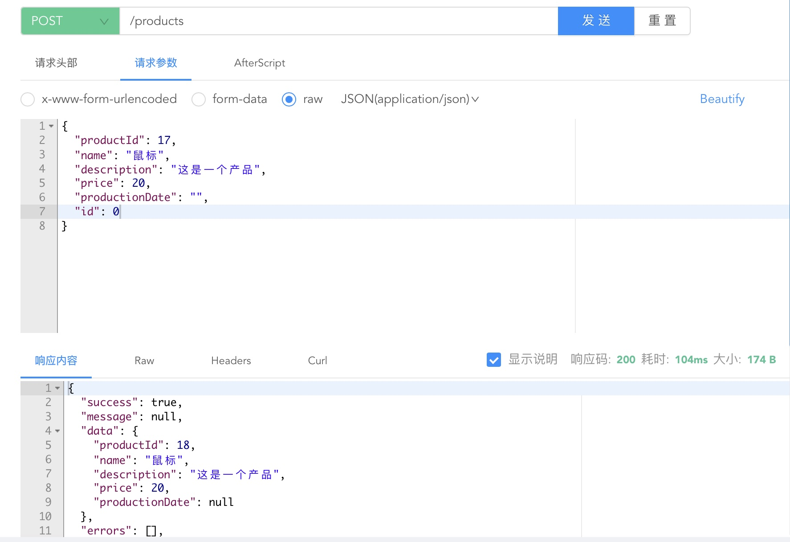
#### 获取产品信息
- **GET /products/{productId}**
    - **描述**：根据产品ID获取产品信息。
    - **路径参数**：`productId`。
    - **响应**：产品详情。
      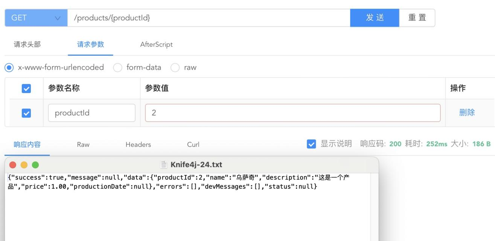
#### 更新产品信息
- **PATCH /products/{productId}**
    - **描述**：更新指定产品的信息。
    - **路径参数**：`productId`。
    - **请求体**：产品的新信息，如名称、描述等。
    - **响应**：更新后的产品详情。
      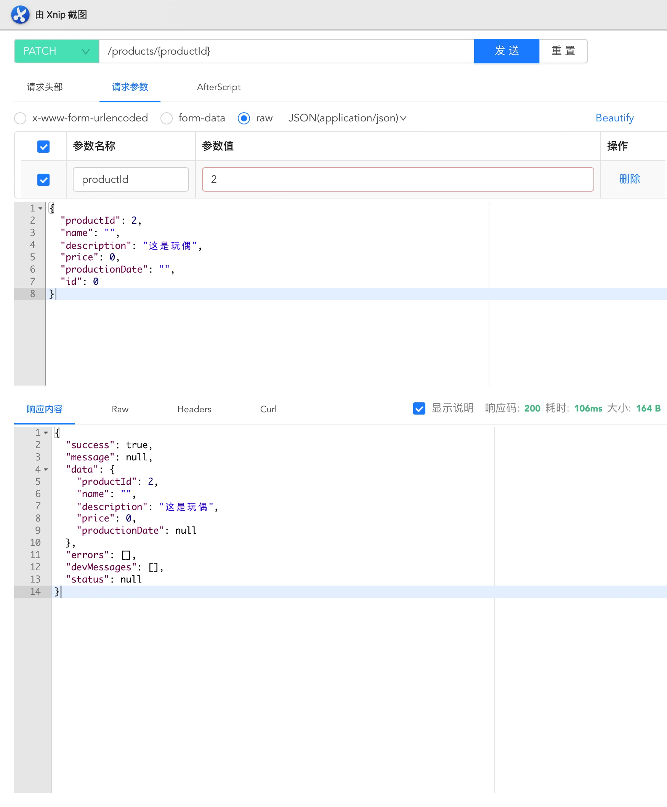
#### 删除产品信息
- **DELETE /products/{productId}**
    - **描述**：从数据库删除指定的产品信息。
    - **路径参数**：`productId`。
    - **响应**：操作结果。
      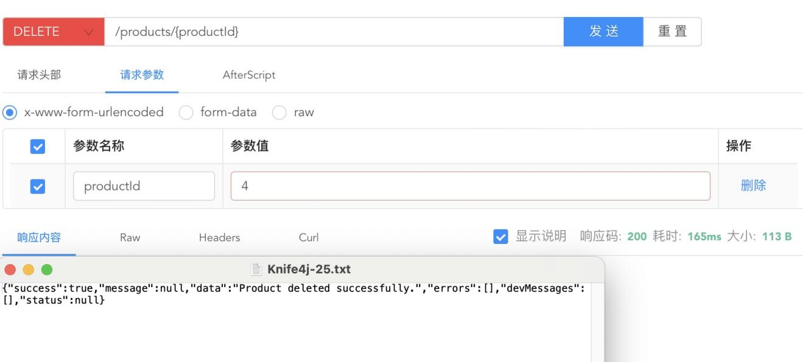